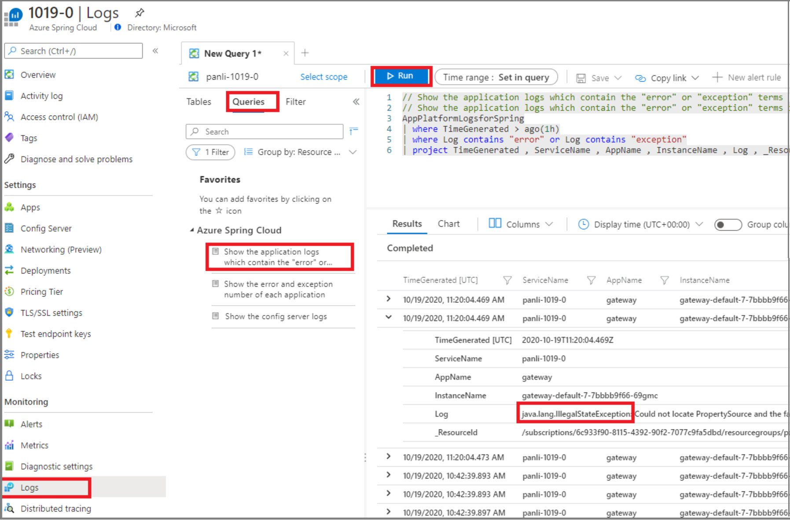

# <a name="quickstart-set-up-azure-spring-cloud-configuration-server"></a>Quickstart: Azure Spring Cloud-configuratieserver instellen

Azure Spring Cloud-configuratieserver is een gecentraliseerde configuratieservice voor gedistribueerde systemen. Hierin wordt een pluggable opslagplaatslaag gebruikt die momenteel ondersteuning biedt voor lokale opslag, Git en Subversion. In deze quickstart stelt u de configuratieserver in om gegevens op te halen uit een Git-opslagplaats.

::: zone pivot="programming-language-csharp"

## <a name="prerequisites"></a>Vereisten

* Voltooi de vorige quickstart in deze serie: [Azure Spring Cloud-service inrichten](spring-cloud-quickstart-provision-service-instance.md).

## <a name="azure-spring-cloud-config-server-procedures"></a>Procedures voor Azure Spring Cloud-configuratieserver

Stel uw configuratieserver in met de locatie van de Git-opslagplaats voor het project door de volgende opdracht uit te voeren. Vervang `<service instance name>` door de naam van de service die u eerder hebt gemaakt. De standaardwaarde voor de naam van het service-exemplaar die u in de voorgaande quickstart hebt ingesteld, werkt niet met deze opdracht.

```azurecli
az spring-cloud config-server git set -n <service instance name> --uri https://github.com/Azure-Samples/Azure-Spring-Cloud-Samples --search-paths steeltoe-sample/config
```

Deze opdracht vertelt de configuratieserver dat deze de configuratiegegevens moet vinden in de map [steeltoe-sample/config](https://github.com/Azure-Samples/Azure-Spring-Cloud-Samples/tree/master/steeltoe-sample/config) in de opslagplaats van de voorbeeld-app. Omdat de naam van de app die de configuratiegegevens ontvangt `planet-weather-provider` is, wordt het bestand [planet-weather-provider.yml](https://github.com/Azure-Samples/Azure-Spring-Cloud-Samples/blob/master/steeltoe-sample/config/planet-weather-provider.yml) gebruikt.

::: zone-end

::: zone pivot="programming-language-java"
Azure Spring Cloud-configuratieserver is een gecentraliseerde configuratieservice voor gedistribueerde systemen. Hierin wordt een pluggable opslagplaatslaag gebruikt die momenteel ondersteuning biedt voor lokale opslag, Git en Subversion.  Stel de configuratieserver in om microservice-apps te implementeren in Azure Spring Cloud.

## <a name="prerequisites"></a>Vereisten

* [JDK 8 installeren](/java/azure/jdk/?preserve-view=true&view=azure-java-stable)
* [Aanmelden voor een Azure-abonnement](https://azure.microsoft.com/free/)
* (Optioneel) [De Azure CLI versie 2.0.67 of hoger installeren](/cli/azure/install-azure-cli?preserve-view=true&view=azure-cli-latest) en de Azure Spring Cloud-extensie installeren met de opdracht: `az extension add --name spring-cloud`
* (Optioneel) [De Azure-toolkit voor IntelliJ installeren](https://plugins.jetbrains.com/plugin/8053-azure-toolkit-for-intellij/) en [aanmelden](/azure/developer/java/toolkit-for-intellij/create-hello-world-web-app#installation-and-sign-in)

## <a name="azure-spring-cloud-config-server-procedures"></a>Procedures voor Azure Spring Cloud-configuratieserver

#### <a name="portal"></a>[Portal](#tab/Azure-portal)

Met de volgende procedure stelt u de configuratieserver in met behulp van de Azure-portal om het [Piggymetrics-voorbeeld](spring-cloud-quickstart-sample-app-introduction.md) te implementeren.

1. Ga naar de pagina **Overzicht** van de service en selecteer **Config Server**.

2. Stel in de sectie **Standaardopslagplaats** **URI** in op https://github.com/Azure-Samples/piggymetrics-config.

3. Klik op **Valideren**.

    

4. Wanneer de validatie is voltooid, klikt u op **Toepassen** om de wijzigingen op te slaan.

    

5. Het bijwerken van de configuratie kan enkele minuten duren.
 
     

6. U ontvangt een melding wanneer de configuratie is voltooid.

#### <a name="cli"></a>[CLI](#tab/Azure-CLI)

In de volgende procedure wordt de Azure CLI gebruikt om de configuratieserver in te stellen om het [Piggymetrics-voorbeeld](spring-cloud-quickstart-sample-app-introduction.md) te implementeren.

Stel uw configuratieserver in met de locatie van de Git-opslagplaats voor het project:

```azurecli
az spring-cloud config-server git set -n <service instance name> --uri https://github.com/Azure-Samples/piggymetrics-config
```
---
::: zone-end

> [!TIP]
> Raadpleeg onze [zelfstudie over het instellen van verificatie](https://docs.microsoft.com/azure/spring-cloud/spring-cloud-tutorial-config-server) als u een privéopslagplaats gebruikt voor de configuratieserver.

## <a name="troubleshooting-of-azure-spring-cloud-config-server"></a>Problemen oplossen met de Azure Spring Cloud-configuratieserver

In de volgende procedure wordt uitgelegd hoe u problemen met de instellingen van de configuratieserver oplost.

1. Ga in Azure Portal naar de servicepagina **Overzicht** en selecteer **Logboeken**. 
1. Selecteer **Query's** en **De toepassingslogboeken weergeven die de termen 'fout' of 'uitzondering' bevatten**. 
1. Klik op **Run**. 
1. Als u in logboeken de fout **java.lang.illegalStateException** vindt, geeft dit aan dat de Spring Cloud-service geen eigenschappen van de configuratieserver kan vinden.

    [  ](media/spring-cloud-quickstart-setup-config-server/setup-config-server-query.png)

1. Ga naar de servicepagina **Overzicht**.
1. Selecteer **Problemen vaststellen en oplossen**. 
1. Selecteer de **Config Server**-detector.

    [  ](media/spring-cloud-quickstart-setup-config-server/setup-config-server-diagnose.png)

3. Klik op **Config Server-statuscontrole**.

    [  ](media/spring-cloud-quickstart-setup-config-server/setup-config-server-genie.png)

4. Klik op **Config Server-status** om meer details van de detector te bekijken.

    [  ](media/spring-cloud-quickstart-setup-config-server/setup-config-server-health-status.png)

## <a name="next-steps"></a>Volgende stappen

In deze quickstarts hebt u Azure-resources gemaakt waarmee de kosten blijven toenemen als de resources in uw abonnement blijven. Zie [Resources opschonen](spring-cloud-quickstart-logs-metrics-tracing.md#clean-up-resources) als u niet wilt doorgaan met de volgende quickstart. Ga anders verder met de volgende quickstart:

> [!div class="nextstepaction"]
> [Apps bouwen en implementeren](spring-cloud-quickstart-deploy-apps.md)
