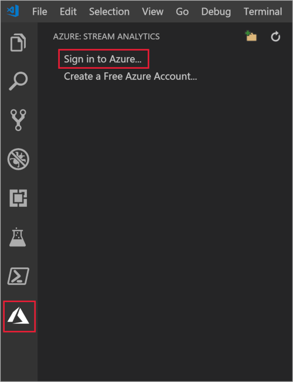
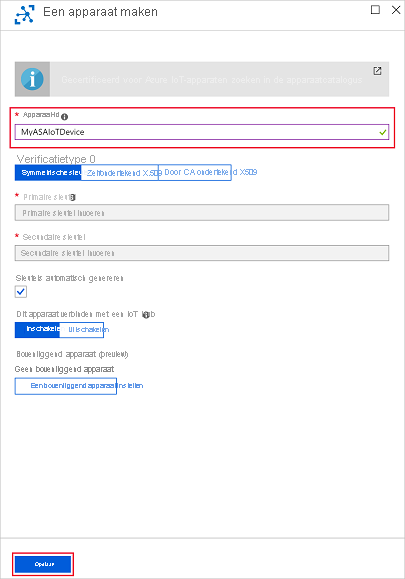
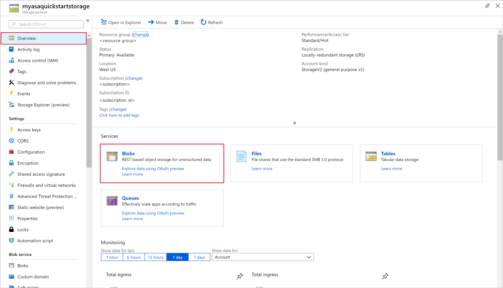
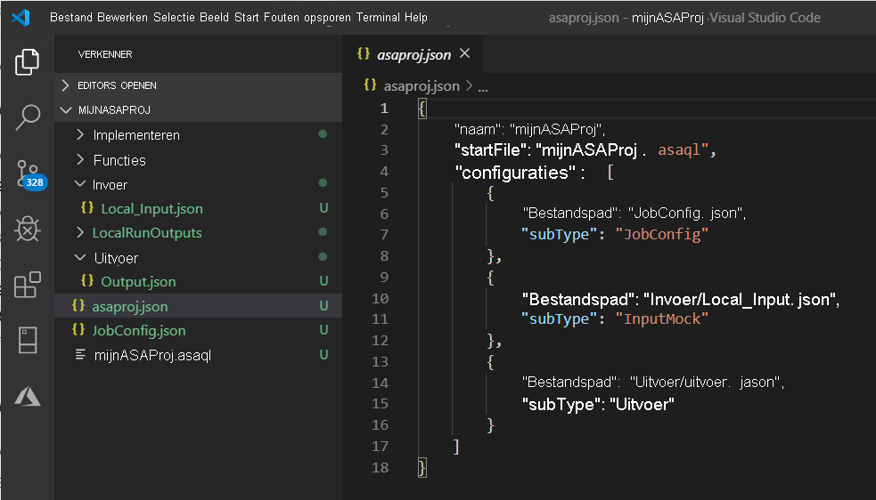
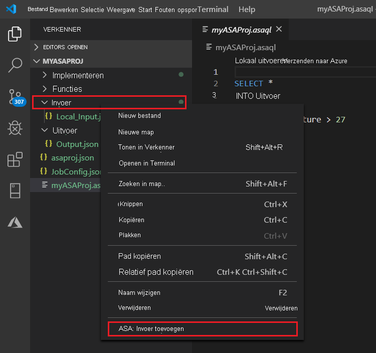
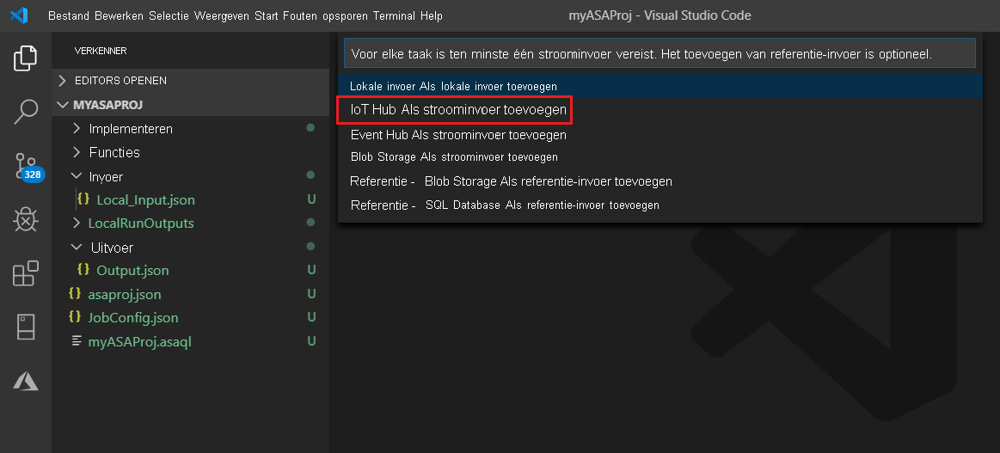
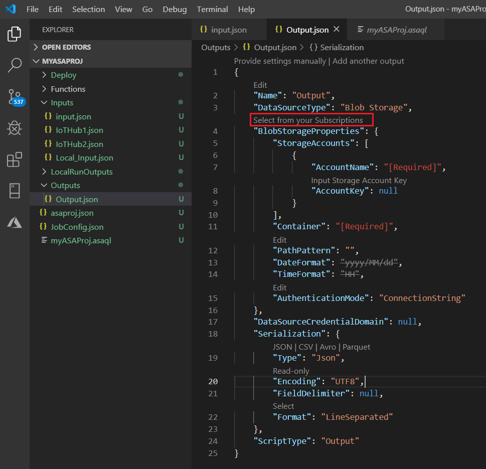
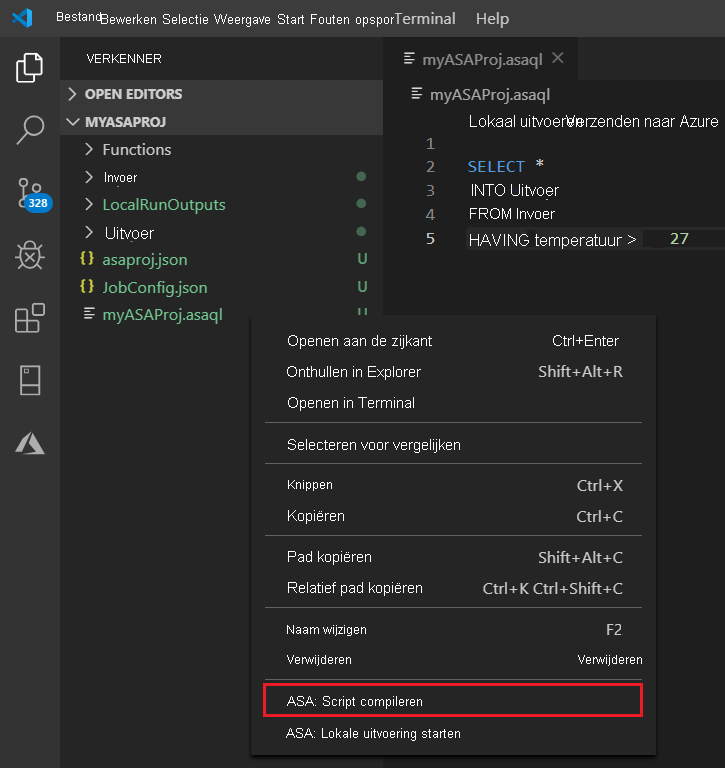
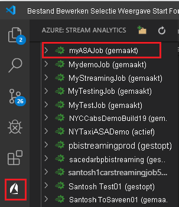
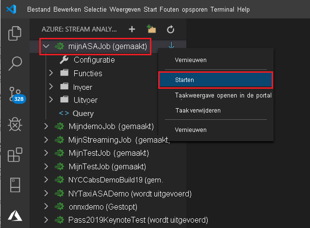

# <a name="quickstart-create-an-azure-stream-analytics-job-in-visual-studio-code-preview"></a>Quickstart: Een Azure Stream Analytics-taak maken in Visual Studio Code (preview-versie)

Deze quickstart laat zien hoe u een Azure Stream Analytics-taak kunt maken en uitvoeren met behulp van de Azure Stream Analytics Tools-extensie voor Visual Studio Code. De voorbeeldtaak leest streaminggegevens vanaf een Azure IoT Hub-apparaat. U definieert een taak die de gemiddelde temperatuur bij meer dan 27° berekent en de resulterende uitvoergebeurtenissen naar een nieuw bestand in blobopslag schrijft.

> [!NOTE]
> De hulpprogramma's Visual Studio en Visual Studio Code bieden geen ondersteuning voor taken in de regio's China - oost, China - noord, Duitsland - centraal en Duitsland - noordoost.

## <a name="before-you-begin"></a>Voordat u begint

* Als u nog geen abonnement op Azure hebt, maakt u een [gratis account](https://azure.microsoft.com/free/) aan.

* Meld u aan bij de [Azure-portal](https://portal.azure.com/).

* Installeer [Visual Studio Code](https://code.visualstudio.com/).

## <a name="install-the-azure-stream-analytics-tools-extension"></a>De Azure Stream Analytics Tools-extensie installeren

1. Open Visual Studio Code.

2. Ga vanuit **Extensies** in het linkerdeelvenster naar **Stream Analytics** en selecteer **Installeren** in de **Azure Stream Analytics Tools**-extensie.

3. Nadat de extensie is geïnstalleerd, controleert u of **Azure Stream Analytics Tools** zichtbaar is in de **ingeschakelde extensies**.

   

## <a name="activate-the-azure-stream-analytics-tools-extension"></a>De Azure Stream Analytics Tools-extensie activeren

1. Selecteer het pictogram **Azure** op de activiteitenbalk van Visual Studio Code. Selecteer **Aanmelden bij Azure** onder **Stream Analytics** in de zijbalk.

   

2. Wanneer u bent aangemeld, wordt de naam van uw Azure-account weergegeven op de statusbalk in de linkerbenedenhoek van het Visual Studio Code-venster.

> [!NOTE]
> Als u zich niet afmeldt, wordt u de volgende keer automatisch aangemeld door de Azure Stream Analytics Tools-extensie. Als uw account tweeledige verificatie heeft, raden wij u aan gebruik te maken van telefoonverificatie in plaats van een pincode.
> Als u problemen hebt met het weergeven van resources, helpt het meestal als u zich afmeldt en opnieuw aanmeldt. Voer de opdracht `Azure: Sign Out` in om u af te melden.

## <a name="prepare-the-input-data"></a>De invoergegevens voorbereiden

Voordat u de Stream Analytics-taak definieert, moet u de gegevens voorbereiden die later als de taakinvoer worden geconfigureerd. Voer de volgende stappen uit om de invoergegevens die vereist zijn voor de taak voor te bereiden:

1. Meld u aan bij de [Azure-portal](https://portal.azure.com/).

2. Selecteer **Een resource maken** > **Internet of Things** > **IoT Hub**.

3. Voer in het deelvenster **IoT Hub** de volgende informatie in:

   |**Instelling**  |**Voorgestelde waarde**  |**Beschrijving**  |
   |---------|---------|---------|
   |Abonnement  | \<Your subscription\> |  Selecteer het Azure-abonnement dat u wilt gebruiken. |
   |Resourcegroep   |   asaquickstart-resourcegroup  |   Selecteer **Nieuwe maken** en voer een naam voor de nieuwe resourcegroep voor uw account in. |
   |Regio  |  \<Select the region that is closest to your users\> | Selecteer een geografische locatie waar u de IoT-hub kunt hosten. Gebruik de locatie die het dichtst bij uw gebruikers is. |
   |Naam van de IoT-hub  | MyASAIoTHub  |   Selecteer een naam voor de IoT-hub.   |

   

4. Selecteer **Volgende: Grootte instellen en schaal aanpassen**.

5. Selecteer een **prijs- en schaalniveau**. Selecteer voor deze quickstart de categorie **F1 - Gratis** als deze nog beschikbaar is voor uw abonnement. Als de categorie Gratis niet beschikbaar is, kiest u de laagste beschikbare categorie. Zie [Prijzen voor Azure IoT Hub](https://azure.microsoft.com/pricing/details/iot-hub/) voor meer informatie.

   

6. Selecteer **Controleren + maken**. Controleer de informatie van de IoT-hub en selecteer **Maken**. Het maken van de IoT-hub kan een paar minuten duren. U kunt de voortgang volgen in het deelvenster **Meldingen**.

7. Selecteer in het IoT Hub-navigatiemenu de optie **Toevoegen** onder **IoT-apparaten**. Voeg een id toe bij **Apparaat-id** en selecteer **Opslaan**.

   

8. Nadat het apparaat is gemaakt, wordt het geopend vanuit de lijst **IoT-apparaten**. Kopieer de tekenreeks in **Verbindingsreeks (primaire sleutel)** en sla deze in een kladblok op voor later gebruik.

   

## <a name="run-the-iot-simulator"></a>De IoT-simulator uitvoeren

1. Open de [Raspberry Pi Azure IoT Online Simulator](https://azure-samples.github.io/raspberry-pi-web-simulator/) in een nieuw browsertabblad of -venster.

2. Vervang de tijdelijke aanduiding in regel 15 door de verbindingsreeks van het IoT-hub-apparaat dat u eerder hebt opgeslagen.

3. Selecteer **Uitvoeren**. De uitvoer geeft de sensorgegevens en berichten weer die worden verzonden naar de IoT-hub.

   

## <a name="create-blob-storage"></a>Blob-opslag maken

1. Selecteer in de linkerbovenhoek in Azure Portal achtereenvolgens **Een resource maken** > **Opslag** > **Opslagaccount**.

2. Voer in het deelvenster **Opslagaccount maken** een opslagaccountnaam, locatie en resourcegroep in. Kies dezelfde locatie en resourcegroep als de IoT-hub die u hebt gemaakt. Selecteer vervolgens **Controleren en maken** om het account te maken.

   

3. Nadat het opslagaccount is gemaakt, selecteert u in het deelvenster **Overzicht** de tegel **Blobs**.

   

4. Selecteer op de pagina **Blob Service** de optie **Container** en geef een naam op voor de container, bijvoorbeeld **container1**. Laat **Niveau openbare toegang** op **Privé (geen anonieme toegang)** staan en selecteer **OK**.

   

## <a name="create-a-stream-analytics-project"></a>Een Stream Analytics-project maken

1. Selecteer in Visual Studio Code **Ctrl+Shift+P** om het opdrachtenpalet te openen. Voer vervolgens **ASA** in en selecteer **ASA: Nieuw project maken**.

   

2. Voer de naam van uw project in, zoals **myASAproj**, en selecteer een map voor uw project.

    

3. Het nieuwe project wordt toegevoegd aan uw werkruimte. Een Stream Analytics-project bestaat uit drie mappen: **Invoer**, **Uitvoer** en **Functies**. Het bevat ook het queryscript **(*.asaql)** , het bestand **JobConfig.json** en het configuratiebestand **asaproj.json**.

    Het configuratiebestand **asaproj. json** bevat de invoer-, uitvoer- en taakconfiguratiebestandgegevens die nodig zijn voor het indienen van de Stream Analytics-taak bij Azure.

    

> [!Note]
> Wanneer u invoer en uitvoer toevoegt vanuit het opdrachtenpalet, worden de bijbehorende paden automatisch toegevoegd aan **asaproj.json**. Als u invoer of uitvoer rechtstreeks aan de schijf toevoegt of verwijdert, moet u deze handmatig toevoegen aan of verwijderen uit **asaproj.json**. U kunt ervoor kiezen om de invoer en uitvoer op één plek te plaatsen en ernaar te verwijzen in verschillende taken door de paden op te geven in elk **asaproj.json**-bestand.

## <a name="define-the-transformation-query"></a>De transformatiequery definiëren

1. Open **myASAproj.asaql** vanuit de projectmap.

2. Voeg de volgende query toe:

   ```sql
   SELECT *
   INTO Output
   FROM Input
   HAVING Temperature > 27
   ```

## <a name="define-a-live-input"></a>Live invoer definiëren

1. Klik met de rechtermuisknop op de map **Invoer** in uw Stream Analytics-project. Selecteer vervolgens **ASA: Invoer toevoegen** vanuit het contextmenu.

    

    Of selecteer in Visual Studio Code **Ctrl+Shift+P** om het opdrachtenpalet te openen en voer **ASA: Invoer toevoegen** in.

   

2. Kies **IoT-hub** voor het type invoer.

   

3. Als u de invoer vanuit het opdrachtenpalet hebt toegevoegd, kiest u het Stream Analytics-queryscript dat de invoer gaat gebruiken. Hierin moet het bestandspad naar **myASAproj.asaql** automatisch worden ingevuld.

   

4. Kies **Selecteren in uw Azure-abonnementen** in de vervolgkeuzelijst.

    

5. Bewerk het zojuist gegenereerde **IoTHub1.json**-bestand met de volgende waarden. Behoud standaardwaarden voor velden die hier niet worden vermeld.

   |Instelling|Voorgestelde waarde|Beschrijving|
   |-------|---------------|-----------|
   |Naam|Invoer|Voer een naam in voor de invoer van de taak.|
   |IotHubNamespace|MyASAIoTHub|Kies uw IoT-hub, of voer de naam ervan in. Namen van IoT-hubs worden automatisch gedetecteerd als ze worden gemaakt in hetzelfde abonnement.|
   |SharedAccessPolicyName|iothubowner| |

   U kunt de functie CodeLens gebruiken om een tekenreeks in te voeren, een selectie in een vervolgkeuzelijst te maken of de tekst rechtstreeks in het bestand te wijzigen. De volgende schermopname toont **Selecteren in uw abonnementen** als voorbeeld. De referenties worden automatisch weergegeven en opgeslagen in de lokale referentiebeheerfunctie.

   

   

## <a name="preview-input"></a>Invoer vooraf bekijken

Selecteer **Gegevens vooraf bekijken** in **IoTHub1.json** vanaf de bovenste regel. Sommige invoergegevens worden opgehaald van de IoT-hub en weergegeven in het voorbeeldvenster. Dit proces kan even duren.

 

## <a name="define-an-output"></a>Uitvoer definiëren

1. Selecteer **Ctrl+Shift+P** om het opdrachtenpalet te openen. Voer vervolgens **ASA: Uitvoer toevoegen** in.

   

2. Kies **Blob Storage** voor het type sink.

3. Kies het Stream Analytics-queryscript dat deze invoer gaat gebruiken.

4. Voer **BlobStorage** als naam van het uitvoerbestand in.

5. Bewerk **BlobStorage** met behulp van de volgende waarden. Behoud standaardwaarden voor velden die hier niet worden vermeld. Gebruik de functie CodeLens om u te helpen bij het maken van een selectie in een vervolgkeuzelijst of het invoeren van een tekenreeks.

   |Instelling|Voorgestelde waarde|Beschrijving|
   |-------|---------------|-----------|
   |Naam|Uitvoer| Voer een naam in voor de uitvoer van de taak.|
   |Opslagaccount|asaquickstartstorage|Kies of typ de naam van het opslagaccount. Namen van opslagaccounts worden automatisch gedetecteerd als ze in hetzelfde abonnement worden gemaakt.|
   |Container|container1|Selecteer de bestaande container die u in uw opslagaccount hebt gemaakt.|
   |Padpatroon|output|Voer de naam in van een bestandspad dat in de container moet worden gemaakt.|

   

## <a name="compile-the-script"></a>Het script compileren

Met de syntaxiscontroles voor scriptcompilatie worden de Azure Resource Manager-sjablonen voor automatische implementatie gegenereerd.

Er zijn twee manieren om scriptcompilatie te activeren:

- Het script selecteren in de werkruimte en vervolgens compileren vanuit het opdrachtenpalet.

   

- Klik met de rechtermuisknop op het script en selecteer **ASA: Script compileren**.

    

Na de compilatie vindt u de twee gegenereerde Azure Resource Manager-sjablonen in de map **Implementatie** van uw project. Deze twee bestanden worden gebruikt voor automatische implementatie.


## <a name="submit-a-stream-analytics-job-to-azure"></a>Een Stream Analytics-taak verzenden naar Azure

1. Selecteer in het scripteditorvenster van het queryscript de optie **Verzenden naar Azure**.

   

2. Selecteer uw abonnement in de pop-uplijst.

3. Kies **Een taak selecteren**. Kies vervolgens **Nieuwe taak maken**.

4. Voer de naam van de taak in, **myASAjob**. Volg vervolgens de instructies om de resourcegroep en de locatie te kiezen.

5. Selecteer **Verzenden naar Azure**. U vindt de logboeken in het uitvoervenster. 

6. Wanneer de taak is gemaakt, kunt u deze in **Stream Analytics Explorer** bekijken.

    

## <a name="start-the-stream-analytics-job-and-check-output"></a>Stream Analytics-taak starten en uitvoer controleren

1. Open **Stream Analytics Explorer** in Visual Studio Code en zoek uw taak, **myASAJob**.

2. Klik met de rechtermuisknop op de naam van de taak. Selecteer vervolgens **Start** in het contextmenu.

   

3. Kies **Nu** in het pop-upvenster om de taak te starten.

4. Houd er rekening mee dat de taakstatus is gewijzigd in **Wordt uitgevoerd**. Klik met de rechtermuisknop op de naam van de taak en selecteer **Taakweergave openen in portal** om de metrische gegevens voor de invoer- en uitvoergebeurtenis weer te geven. Deze actie kan enkele minuten duren.

5. Als u de resultaten wilt weergeven, opent u de blob-opslag in de Visual Studio Code-extensie of in Azure Portal.

## <a name="clean-up-resources"></a>Resources opschonen

Wanneer u deze niet meer nodig hebt, verwijdert u de resourcegroep, de streamingtaak en alle gerelateerde resources. Door de taak te verwijderen, voorkomt u dat de streaming-eenheden die door de taak worden verbruikt, in rekening worden gebracht. 

Als u denkt dat u de taak in de toekomst nog gaat gebruiken, kunt u deze stoppen en later opnieuw starten. Als u deze taak niet meer gaat gebruiken, voert u de volgende stappen uit om alle resources die in deze quickstart zijn gemaakt te verwijderen:

1. Selecteer in het menu aan de linkerkant in Azure Portal de optie **Resourcegroepen** en selecteer vervolgens de naam van de resource die u hebt gemaakt.  

2. Selecteer **Verwijderen** op de pagina van de resourcegroep. Voer de naam van de resource die u wilt verwijderen in het tekstvak in en selecteer vervolgens **Verwijderen**.

## <a name="next-steps"></a>Volgende stappen

In deze quickstart hebt u een eenvoudige Stream Analytics-taak met behulp van Visual Studio Code geïmplementeerd. U kunt Stream Analytics-taken ook implementeren met behulp van [Azure Portal](stream-analytics-quick-create-portal.md), [PowerShell](stream-analytics-quick-create-powershell.md) en [Visual Studio](stream-analytics-quick-create-vs.md).

Ga voor meer informatie over Azure Stream Analytics-hulpprogramma's voor Visual Studio Code naar het volgende artikel:

* [Stream Analytics-query's lokaal testen met voorbeeldgegevens testen met behulp van Visual Studio Code](visual-studio-code-local-run.md)

* [Azure Stream Analytics-taken lokaal testen met live invoer met behulp van Visual Studio Code](visual-studio-code-local-run-live-input.md)

* [Visual Studio Code gebruiken om Azure Stream Analytics-taken weer te geven](visual-studio-code-explore-jobs.md)

* [CI/CD-pijplijnen instellen met behulp van het NPM-pakket](./cicd-overview.md)