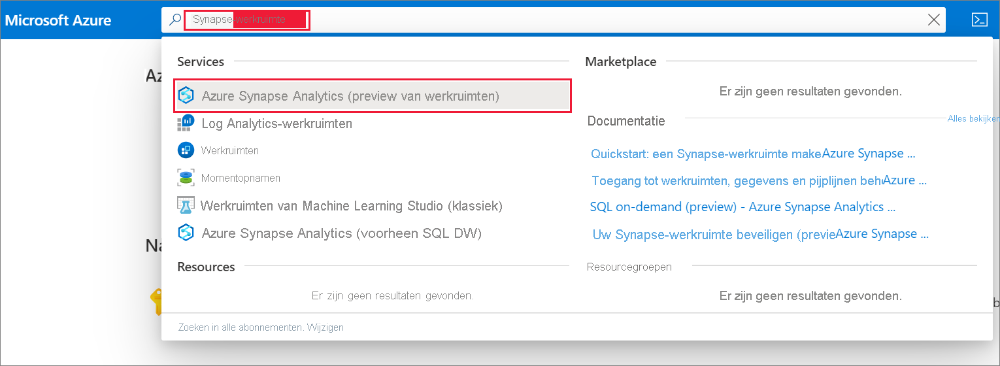

# Quickstart: Een Synapse-werkruimte maken

In deze quickstart wordt stapsgewijs beschreven hoe u een Azure Synapse-werkruimte maakt met Azure Portal.

Als u geen Azure-abonnement hebt, [maakt u een gratis account voordat u begint](https://azure.microsoft.com/free/).

## Vereisten

- [Azure Data Lake Storage Gen2-opslagaccount](../storage/common/storage-account-create.md?toc=/azure/synapse-analytics/toc.json&bc=/azure/synapse-analytics/breadcrumb/toc.json)

## Aanmelden bij Azure Portal

Meld u aan bij [Azure Portal](https://portal.azure.com/)

## Een Azure Synapse-werkruimte maken met Azure Portal

1. Voer in het Microsoft Azure-zoekvenster **Synapse-werkruimte** in en selecteer vervolgens deze service.

2. Klik op de pagina **Synapse-werkruimten** op **+Toevoegen**.

3. Vul het formulier van de **Azure Synapse-werkruimte** in met de volgende gegevens:

    | Instelling | Voorgestelde waarde | Beschrijving |
    | :------ | :-------------- | :---------- |
    | **Abonnement** | *Uw abonnement* | Zie [Abonnementen](https://account.windowsazure.com/Subscriptions) voor meer informatie over uw abonnementen. |
    | **Resourcegroep** | *Een resourcegroep* | Zie [Naming conventions](/azure/architecture/best-practices/resource-naming?toc=/azure/synapse-analytics/toc.json&bc=/azure/synapse-analytics/breadcrumb/toc.json&view=azure-sqldw-latest) (Naamgevingsconventies) voor geldige resourcegroepnamen. |
    | **Werkruimtenaam** | mysampleworkspace | Hiermee geeft u de naam op van de werkruimte die ook wordt gebruikt voor verbindingseindpunten.|
    | **Regio** | VS - oost 2 | Geeft de locatie van de werkruimte aan.|
    | **Data Lake Storage Gen2** | Account: `storage account name`   Bestandssysteem: `root file system to use` | Hiermee geeft u de naam op van het ADLS Gen2-opslagaccount dat moet worden gebruikt als primaire opslag en het bestandssysteem dat moet worden gebruikt.|
    ||||

    

    Het opslagaccount kan worden geselecteerd in:
    - Een lijst met ADLS Gen2-accounts die beschikbaar zijn in uw abonnement
    - Handmatig ingevoerd met de accountnaam

    > [!IMPORTANT]
    > De Azure Synapse-werkruimte moet kunnen lezen uit en schrijven naar het geselecteerde ADLS Gen2-account. Daarnaast moet u voor elk opslagaccount dat u als primair opslagaccount koppelt **hiërarchische naamruimte** hebben ingeschakeld bij het maken van het opslagaccount.
    >
    > Onder de ADLS Gen2-selectievelden ziet u een opmerking waarin wordt vermeld dat aan de beheerde identiteit van de werkruimte de rol **Storage Blob Data Contributor** voor het geselecteerde Data Lake Storage Gen2-bestandssysteem wordt toegewezen, zodat deze volledige toegang heeft.

4. (Optioneel) Wijzig de standaardinstellingen op het tabblad **Beveiliging en netwerken**:
5. (Optioneel) Voeg labels toe op het tabblad **Tags**.
6. Op het tabblad **Overzicht** worden de benodigde validaties uitgevoerd zodat de werkruimte kan worden gemaakt. Wanneer de validatie is voltooid, selecteert u **Maken** 
7. Wanneer de resource eenmaal is ingericht, ziet u een vermelding voor de gemaakte werkruimte in de lijst met Synapse-werkruimten. 

## Resources opschonen

Voer de onderstaande stappen uit om de Azure Synapse-werkruimte te verwijderen.
> [!WARNING]
> Als u een Azure Synapse-werkruimte verwijdert, worden de analyse-engines en de gegevens die zijn opgeslagen in de database van de SQL-pools die het bevat en de metagegevens van de werkruimte verwijderd. Er kan geen verbinding meer worden gemaakt met de SQL-eindpunten en Apache Spark-eindpunten. Alle codeartefacten worden verwijderd (query's, notebooks, taakdefinities en pijplijnen).
>
> Als u de werkruimte verwijdert, heeft dit **geen** invloed op de gegevens in het Data Lake Storage Gen2-account dat aan de werkruimte is gekoppeld.

Als u de Azure Synapse-werkruimte wilt verwijderen, voert u de volgende stappen uit:

1. Ga naar de Azure Synapse-werkruimte die u wilt verwijderen.
1. Selecteer in de opdrachtbalk de optie **Verwijderen**.
 
1. Bevestig dat u de werkruimte wilt verwijderen en selecteer de knop **Verwijderen**.
 
1. Wanneer de werkruimte is verwijderd, wordt de Azure Synapse-werkruimte niet meer weergegeven in de lijst met werkruimten.

## Volgende stappen

Vervolgens kunt u [SQL-pools maken](quickstart-create-sql-pool-studio.md) of [Apache Spark-pools maken](quickstart-create-apache-spark-pool-studio.md) zodat u uw gegevens kunt gaan analyseren en verkennen.
