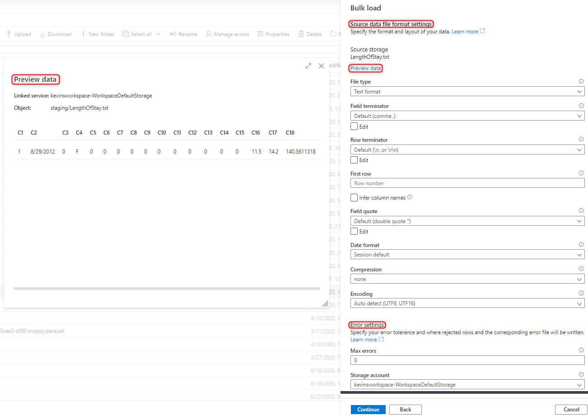

# Bulksgewijs laden met Synapse SQL

Met de wizard voor bulksgewijs laden in Synapse Studio kunt u nu heel eenvoudig gegevens laden. In deze wizard maakt u een T-SQL-script met de [COPY-instructie](https://docs.microsoft.com/sql/t-sql/statements/copy-into-transact-sql?view=azure-sqldw-latest) om gegevens bulksgewijs te laden. 

## Invoerpunten voor de wizard Bulksgewijs laden

U kunt gegevens nu gemakkelijk bulksgewijs laden met SQL-pools. Klik daarvoor met de rechtermuisknop op de volgende gebieden in Synapse Studio:

- Een bestand of map uit een Azure-opslagaccount, toegevoegd aan uw werkruimte 

## Vereisten

- Deze wizard genereert een COPY-instructie die gebruikmaakt van AAD-pass-through voor verificatie. Uw [AAD-gebruiker moet toegang hebben](https://docs.microsoft.com/azure/synapse-analytics/sql-data-warehouse/quickstart-bulk-load-copy-tsql-examples#d-azure-active-directory-authentication-aad) tot de werkruimte met ten minste de Azure-rol Bijdrager voor opslagblobgegevens voor het ADLS Gen2-account.

- U moet beschikken over de vereiste [machtigingen om de COPY-instructie te gebruiken](https://docs.microsoft.com/sql/t-sql/statements/copy-into-transact-sql?view=azure-sqldw-latest#permissions) en ook over machtigingen om een tabel te maken, als u gegevens in een nieuwe tabel wilt laden.

- De service die aan het ADLS Gen2-account is gekoppeld, **moet toegang hebben tot het bestand dat**/**de map die** moet worden geladen. Als de verificatiemethode van de gekoppelde service bijvoorbeeld Beheerde identiteit is, moet de beheerde identiteit voor de werkruimte ten minste over de machtiging Lezer van opslagblob beschikken voor het opslagaccount.

- Als VNet is ingeschakeld voor uw werkruimte, controleert u of interactieve creatie is ingeschakeld voor de geïntegreerde runtime van de gekoppelde services van het ADLS Gen2-account voor de locatie van de brongegevens en foutbestanden. Interactieve creatie is vereist om schema's automatisch te detecteren, previews van de inhoud van het bronbestand te bekijken en door ADLS Gen2-opslagaccounts in de wizard te bladeren.

### Stappen

1. Selecteer het opslagaccount en het bestand of de map waaruit u gegevens wilt laden in het venster Opslaglocatie van bron: 

2. Selecteer de instellingen voor de bestandsindeling, waaronder het opslagaccount waarnaar u geweigerde rijen wilt schrijven (foutbestand). Momenteel worden alleen CSV- en Parquet-bestanden ondersteund.

    

3. Klik op Voorbeeld van gegevens weergeven om te zien hoe de COPY-instructie het bestand parseert. Configureer op basis hiervan de instellingen voor bestandsindeling. Telkens wanneer u een instelling voor de bestandsindeling wijzigt, klikt u op Voorbeeld van gegevens weergeven om te zien hoe de COPY-instructie het bestand parseert met de bijgewerkte instelling:  

4. Selecteer de SQL-pool die u gebruikt om gegevens te laden en geef aan of de gegevens naar een bestaande of nieuwe tabel moeten worden geladen: 

5. Klik op Kolomtoewijzing configureren om te controleren of u de juiste kolomtoewijzing gebruikt. Bij nieuwe tabellen is het van cruciaal belang dat u de kolomtoewijzing configureert om de gegevenstypen van de doelkolom bij te werken: 

6. Klik op Script openen. Er wordt een T-SQL-script gegenereerd met de COPY-instructie om gegevens uit uw data lake te laden: 

## Volgende stappen

- Raadpleeg het artikel over de [COPY-instructie](https://docs.microsoft.com/sql/t-sql/statements/copy-into-transact-sql?view=azure-sqldw-latest#syntax) voor meer informatie over de mogelijkheden van COPY.
- Bekijk het overzichtsartikel over [gegevens laden](https://docs.microsoft.com/azure/synapse-analytics/sql-data-warehouse/design-elt-data-loading#what-is-elt).
