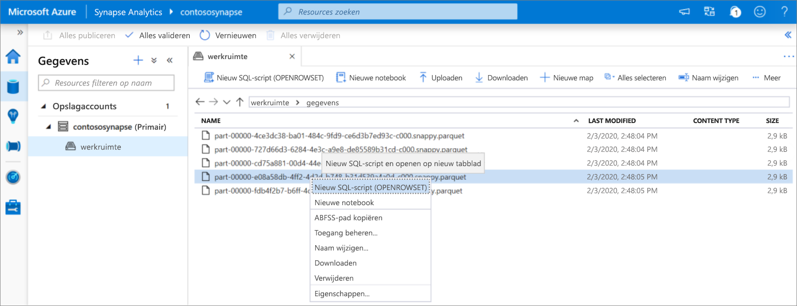

# Snelstart: Synapse Studio gebruiken (preview)

In deze quickstart leert u hoe u bestanden opvragen met Synapse Studio.

Als u geen Azure-abonnement hebt, maakt u een [gratis](https://azure.microsoft.com/free/) account voordat u begint.

## Aanmelden bij Azure Portal

Meld u aan bij de [Azure-portal](https://portal.azure.com/).

## Vereisten

[Maak een Azure Synapse-werkruimte en bijbehorend opslagaccount](quickstart-create-workspace.md).

## Start Synapse Studio

Klik in uw Azure Synapse-werkruimte in de Azure-portal op **Synapse Studio starten**.

U Synapse Studio ook starten door op [Azure Synapse Analytics](https://web.azuresynapse.net) te klikken en de juiste tenant-, abonnements- en werkruimtewaarden op te geven.

## Bladeren door opslagaccounts

Zodra u Synapse Studio opent, bladert u naar **Gegevens** en vouwt u **Opslagaccounts** uit om het opslagaccount in de werkruimte weer te geven.

U nieuwe mappen maken en bestanden uploaden met behulp van de werkbalk koppelingen om uw bestanden te ordenen.

## Querybestanden op opslagaccount

> [!IMPORTANT]
> U moet lid zijn `Storage Blob Reader` van de rol op de onderliggende opslag om de bestanden te kunnen opvragen. Meer informatie over het [toewijzen van **Storage Blob-gegevenslezer** of **RBAC-machtigingen voor opslagblobgegevens inzender** rbac op Azure Storage](../storage/common/storage-auth-aad-rbac-portal.md?toc=/azure/synapse-analytics/toc.json&bc=/azure/synapse-analytics/breadcrumb/toc.json#assign-a-built-in-rbac-role).

1. Upload `PARQUET` sommige bestanden.
2. Selecteer een of meer bestanden en maak vervolgens een nieuw SQL-script of een Spark-notitieblok om de inhoud van de bestanden te bekijken. Als u een notitieblok wilt maken, moet u [de Apache Spark-pool in de werkruimte](spark/apache-spark-notebook-create-spark-use-sql.md)maken.

   

3. Voer de gegenereerde query of het notitieblok uit om de inhoud van het bestand te bekijken:

   

4. U de query wijzigen om resultaten te filteren en te sorteren. Zoek taalfuncties die beschikbaar zijn in SQL on-demand in [SQL-functiesoverzicht.](sql/overview-features.md)

## Volgende stappen

- Azure AD-gebruikers in staat stellen bestanden op te vragen [door RBAC-machtigingen voor **Opslagblob-gegevenslezer** of **Opslagblobgegevensinzender** ](../storage/common/storage-auth-aad-rbac-portal.md?toc=/azure/synapse-analytics/toc.json&bc=/azure/synapse-analytics/breadcrumb/toc.json#assign-a-built-in-rbac-role) toe te staan in Azure Storage
- [Querybestanden op Azure Storage met SQL On-Demand](sql/on-demand-workspace-overview.md)
- [Groep Apache Spark maken](spark/apache-spark-notebook-create-spark-use-sql.md)
- [Power BI-rapport maken over bestanden die zijn opgeslagen in Azure Storage](sql/tutorial-connect-power-bi-desktop.md)
