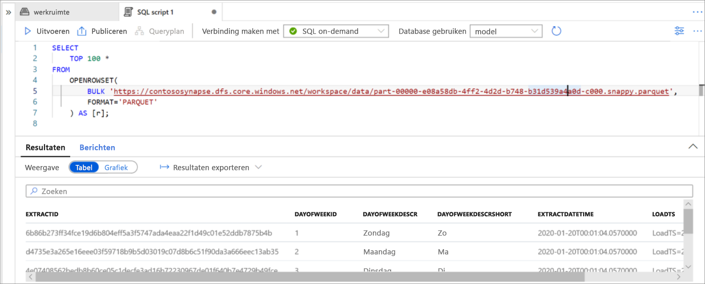

# Quickstart: Synapse Studio (preview) gebruiken

In deze quickstart leert u hoe u een query kunt uitvoeren op bestanden met behulp van Synapse Studio.

Als u nog geen Azure-abonnement hebt, maakt u een [gratis account](https://azure.microsoft.com/free/) voordat u begint.

## Aanmelden bij Azure Portal

Meld u aan bij de [Azure-portal](https://portal.azure.com/).

## Vereisten

[Een Azure Synapse-werkruimte en een gekoppeld opslagaccount maken](quickstart-create-workspace.md).

## Synapse Studio starten

Klik in uw Azure Synapse-werkruimte in de Azure-portal op **Synapse Studio starten**.

U kunt Synapse Studio ook starten door op [Azure Synapse Analytics](https://web.azuresynapse.net) te klikken en de juiste waarden op de gegeven voor tenant, abonnement en werkruimte.

## Door opslagaccounts bladeren

Nadat u Synapse Studio hebt geopend, bladert u naar **Gegevens** en vouwt u vervolgens **Opslagaccounts** uit om het opslagaccount in de werkruimte weer te geven.

U kunt nieuwe mappen maken en bestanden uploaden via de koppelingen op de werkbalk om uw bestanden te organiseren.

## Query’s uitvoeren op bestanden in een opslagaccount

> [!IMPORTANT]
> U moet lid zijn van de rol `Storage Blob Reader` voor de onderliggende opslag om query's te kunnen uitvoeren op de bestanden. Leer hoe u [RBAC-machtigingen voor **Gegevenslezer voor opslagblob** of **Gegevensbijdrager voor opslagblob** toewijst in Azure Storage](../storage/common/storage-auth-aad-rbac-portal.md?toc=/azure/synapse-analytics/toc.json&bc=/azure/synapse-analytics/breadcrumb/toc.json#assign-an-azure-built-in-role).

1. Upload enkele `PARQUET`-bestanden.
2. Selecteer een of meer bestanden en maak vervolgens een nieuw SQL-script of een Spark-notebook om de inhoud van de bestanden te bekijken. Als u een notebook wilt maken, moet u een [Apache Spark-pool in Synapse-werkruimten](quickstart-create-apache-spark-pool-studio.md) maken.

   

3. Voer de gegenereerde query of notebook uit om de inhoud van het bestand te bekijken.

   

4. U kunt de query wijzigen om de resultaten te filteren en te sorteren. Zoek in [overzicht van SQL-functies](sql/overview-features.md) taalfuncties die beschikbaar zijn in SQL on-demand.

## Volgende stappen

- Stel Azure AD-gebruikers in staat om query’s uit te voeren op bestanden [door RBAC-machtigingen voor **Gegevenslezer voor opslagblob** of **Gegevensbijdrager voor opslagblob** toe te wijzen in Azure Storage](../storage/common/storage-auth-aad-rbac-portal.md?toc=/azure/synapse-analytics/toc.json&bc=/azure/synapse-analytics/breadcrumb/toc.json#assign-an-azure-built-in-role)
- [Query's uitvoeren op Azure Storage met behulp van SQL on-demand](sql/on-demand-workspace-overview.md)
- [Create Apache Spark pool using Azure portal](quickstart-create-apache-spark-pool-portal.md) (Een Apache Spark-pool maken met behulp van de Azure-portal)
- [Een Power BI-rapport maken voor bestanden die zijn opgeslagen in Azure Storage](sql/tutorial-connect-power-bi-desktop.md)
