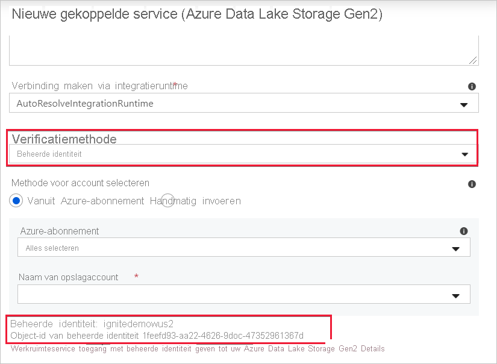

# Beheerde identiteit voor Azure Synapse-werk ruimte (preview)

In dit artikel vindt u meer informatie over beheerde identiteiten in de Azure Synapse-werk ruimte.

## Beheerde identiteiten

Beheerde identiteit voor Azure-resources is een functie van Azure Active Directory. De functie biedt Azure-services met een automatisch beheerde identiteit in Azure AD. U kunt de mogelijkheid van beheerde identiteit gebruiken voor verificatie bij elke service die ondersteuning biedt voor Azure AD-verificatie.

Beheerde identiteiten voor Azure-resources zijn de nieuwe naam voor de service, voorheen bekend als Managed Service Identity (MSI). Zie [beheerde identiteiten](../../active-directory/managed-identities-azure-resources/overview.md?toc=/azure/synapse-analytics/toc.json&bc=/azure/synapse-analytics/breadcrumb/toc.json) voor meer informatie.

## Beheerde identiteit voor Azure Synapse-werk ruimte

Wanneer u de werk ruimte maakt, wordt er een door het systeem toegewezen beheerde identiteit gemaakt voor uw Azure Synapse-werk ruimte.

>[!NOTE]
>Deze beheerde identiteit van de werk ruimte wordt aangeduid als beheerde identiteit via de rest van dit document.

Azure Synapse maakt gebruik van de beheerde identiteit om pijp lijnen te organiseren. De levens cyclus van beheerde identiteiten is rechtstreeks gekoppeld aan de Azure Synapse-werk ruimte. Als u de Azure Synapse-werk ruimte verwijdert, wordt de beheerde identiteit ook opgeruimd.

De beheerde identiteit van de werk ruimte moet machtigingen hebben om bewerkingen uit te voeren in de pijp lijnen. U kunt de object-ID of de naam van uw Azure Synapse-werk ruimte gebruiken om de beheerde identiteit te vinden bij het verlenen van machtigingen.

## Beheerde identiteit ophalen in Azure Portal

U kunt de beheerde identiteit ophalen in Azure Portal. Open de Azure Synapse-werk ruimte in Azure Portal en selecteer **overzicht** in het navigatie deel venster aan de linkerkant. De object-ID van de beheerde identiteit wordt weer gegeven in het hoofd scherm.

De beheerde identiteits gegevens worden ook weer gegeven wanneer u een gekoppelde service maakt die beheerde identiteits verificatie ondersteunt vanuit Azure Synapse Studio.

Start **Azure Synapse Studio** en selecteer het tabblad **beheren** vanuit het navigatie venster aan de linkerkant. Selecteer vervolgens **gekoppelde services** en kies de optie **+ Nieuw** om een nieuwe gekoppelde service te maken.

Typ *Azure data Lake Storage Gen2*in het venster **nieuwe gekoppelde service** . Selecteer in de onderstaande lijst het resource type **Azure data Lake Storage Gen2** en kies **door gaan**.

Kies in het volgende venster **beheerde identiteit** voor **verificatie methode**. U ziet de **naam** en **object-id**van de beheerde identiteit.

## Volgende stappen

[Machtigingen verlenen aan de beheerde identiteit van de Azure Synapse-werk ruimte](./how-to-grant-workspace-managed-identity-permissions.md)
