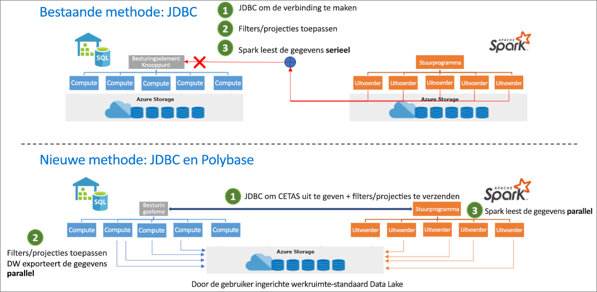

# <a name="introduction"></a>Inleiding

De Azure Synapse Apache Spark naar Synapse SQL-connector is ontworpen om efficiënt gegevens over te dragen tussen Spark-pools (preview) en SQL-pools in Azure Synapse. De Azure Synapse Apache Spark naar Synapse SQL-connector werkt alleen in SQL-pools, maar werkt niet met SQL on-demand.

## <a name="design"></a>Ontwerp

Het overbrengen van gegevens tussen Spark-pools en SQL-pools kan worden uitgevoerd met JDBC. Maar op twee gedistribueerde systemen, zoals Spark en SQL-pools, is JDBC meestal een knelpunt wat betreft seriële gegevensoverdracht.

De Azure Synapse Apache Spark pool naar Synapse SQL-connector is een gegevensbronimplementatie voor Apache Spark. De Azure Data Lake Storage Gen2 en Polybase in SQL-pools worden gebruikt om efficiënt gegevens over te dragen tussen het Spark-cluster en het Synapse SQL-exemplaar.



## <a name="authentication-in-azure-synapse-analytics"></a>Verificatie in Azure Synapse Analytics

Verificatie tussen systemen wordt in Azure Synapse Analytics naadloos gemaakt. Er is een tokenservice die verbinding maakt met Azure Active Directory om beveiligingstokens te verkrijgen die kunnen worden gebruikt bij het openen van het opslagaccount of de datawarehouse-server. 

Daarom is het niet nodig om referenties te maken of op te geven in de connector-API zolang AAD-verificatie is geconfigureerd op het opslagaccount en de datawarehouse-server. Als dat niet het geval is, kan de SQL-verificatie worden opgegeven. Meer informatie vindt u in de sectie [Gebruik](#usage).

## <a name="constraints"></a>Beperkingen

- Deze connector werkt alleen in Scala.

## <a name="prerequisites"></a>Vereisten

- Laat d erol **db_exporter** in de database/SQL-pool waarnaar u gegevens wilt overdragen.

Als u gebruikers wilt maken, maakt u verbinding met de database en volgt u deze voorbeelden:

```sql
CREATE USER Mary FROM LOGIN Mary;
CREATE USER [mike@contoso.com] FROM EXTERNAL PROVIDER;
```

Om een rol toe te wijzen:

```sql
EXEC sp_addrolemember 'db_exporter', 'Mary';
```

## <a name="usage"></a>Gebruik

De instructies voor importeren zijn niet vereist, ze worden vooraf geïmporteerd voor de notebookervaring.

### <a name="transferring-data-to-or-from-a-sql-pool-attached-with-the-workspace"></a>Gegevens overdragen van of naar een SQL-pool die is gekoppeld aan de werkruimte

> [!NOTE]
> **Importeren niet vereist in notebookervaring**

```scala
 import com.microsoft.spark.sqlanalytics.utils.Constants
 import org.apache.spark.sql.SqlAnalyticsConnector._
```

#### <a name="read-api"></a>API lezen

```scala
val df = spark.read.sqlanalytics("[DBName].[Schema].[TableName]")
```

De bovenstaande API werkt zowel voor interne (beheerde) als voor externe tabellen in de SQL-pool.

#### <a name="write-api"></a>API schrijven

```scala
df.write.sqlanalytics("[DBName].[Schema].[TableName]", [TableType])
```

waarbij Table Type Constants.INTERNAL of Constants.EXTERNAL kan zijn

```scala
df.write.sqlanalytics("[DBName].[Schema].[TableName]", Constants.INTERNAL)
df.write.sqlanalytics("[DBName].[Schema].[TableName]", Constants.EXTERNAL)
```

De verificatie voor opslag en de SQL-server is voltooid

### <a name="if-you-are-transferring-data-to-or-from-a-sql-pool-or-database-outside-the-workspace"></a>Als u gegevens overbrengt naar of van een SQL-pool of database buiten de werkruimte

> [!NOTE]
> Importeren niet vereist in notebookervaring

```scala
 import com.microsoft.spark.sqlanalytics.utils.Constants
 import org.apache.spark.sql.SqlAnalyticsConnector._
```

#### <a name="read-api"></a>API lezen

```scala
val df = spark.read.
option(Constants.SERVER, "samplews.database.windows.net").
sqlanalytics("<DBName>.<Schema>.<TableName>")
```

#### <a name="write-api"></a>API schrijven

```scala
df.write.
option(Constants.SERVER, "[samplews].[database.windows.net]").
sqlanalytics("[DBName].[Schema].[TableName]", [TableType])
```

### <a name="using-sql-auth-instead-of-aad"></a>SQL-verificatie gebruiken in plaats van AAD

#### <a name="read-api"></a>API lezen

De connector biedt momenteel geen ondersteuning voor verificatie op basis van tokens naar een SQL-pool die zich buiten de werkruimte bevindt. U moet SQL-verificatie gebruiken.

```scala
val df = spark.read.
option(Constants.SERVER, "samplews.database.windows.net").
option(Constants.USER, [SQLServer Login UserName]).
option(Constants.PASSWORD, [SQLServer Login Password]).
sqlanalytics("<DBName>.<Schema>.<TableName>")
```

#### <a name="write-api"></a>API schrijven

```scala
df.write.
option(Constants.SERVER, "[samplews].[database.windows.net]").
option(Constants.USER, [SQLServer Login UserName]).
option(Constants.PASSWORD, [SQLServer Login Password]).
sqlanalytics("[DBName].[Schema].[TableName]", [TableType])
```

### <a name="using-the-pyspark-connector"></a>De PySpark-connector gebruiken

> [!NOTE]
> In dit voorbeeld is alleen gericht op de notebookervaring.

Stel dat u een dataframe "pyspark_df" hebt die u naar de DW wilt schrijven.

Maak een tijdelijke tabel met behulp van de dataframe in PySpark:

```py
pyspark_df.createOrReplaceTempView("pysparkdftemptable")
```

Voer een Scala-cel in het PySpark-notebook uit met behulp van magics:

```scala
%%spark
val scala_df = spark.sqlContext.sql ("select * from pysparkdftemptable")

pysparkdftemptable.write.sqlanalytics("sqlpool.dbo.PySparkTable", Constants.INTERNAL)
```

Lees in het leesscenario de gegevens met behulp van Scala en schrijf deze in een tijdelijke tabel, en gebruik Spark SQL in PySpark om de tijdelijke tabel in een dataframe aan te vragen.

## <a name="allowing-other-users-to-use-the-dw-connector-in-your-workspace"></a>Andere gebruikers toestaan de DW-connector in uw werkruimte te gebruiken

U moet de eigenaar van de opslagblobgegevens zijn op het ADLS Gen2-opslagaccount dat is verbonden met de werkruimte om ontbrekende machtigingen voor anderen te wijzigen. Zorg ervoor dat de gebruiker toegang heeft tot de werkruimte en de machtigingen voor het uitvoeren van notebooks.

### <a name="option-1"></a>Optie 1

- Maak de gebruiker een Inzender/Eigenaar van opslagblobgegevens

### <a name="option-2"></a>Optie 2

- Geef de volgende ACL's op in de mappenstructuur:

| Map | / | synapse | workspaces  | <workspacename> | sparkpools | <sparkpoolname>  | sparkpoolinstances  |
|--|--|--|--|--|--|--|--|
| Toegangsmachtigingen | --X | --X | --X | --X | --X | --X | -WX |
| Standaardmachtigingen | ---| ---| ---| ---| ---| ---| ---|

- U moet ACL kunnen toepassen op alle folders van "synapse" en omlaag vanuit het Azure-portal. Om ACL toe te passen op de hoofdmap "/" folder, volgt u de onderstaande instructies.

- Verbinding maken met het opslagaccount dat is verbonden met de werkruimte vanuit Storage Explorer met AAD
- Selecteer uw account en geef de ADLS Gen2 URL en het standaardbestandssysteem voor de werkruimte op
- Zodra u het vermelde opslagaccount kunt zien, klikt u met de rechtermuisknop op de vermelding werkruimte en selecteert u "Toegang beheren"
- Voeg de Gebruiker toe aan de /-map met de toegangsmachtiging "Uitvoeren". Selecteer "OK"

> [!IMPORTANT]
> Zorg ervoor dat u niet "Standaard" selecteert als u dit niet wilt.

## <a name="next-steps"></a>Volgende stappen

- [Een SQL-pool maken met behulp van de Azure-portal](../../synapse-analytics/quickstart-create-apache-spark-pool-portal.md)
- [Een nieuwe Apache Spark-pool maken met behulp van de Azure-portal](../../synapse-analytics/quickstart-create-apache-spark-pool-portal.md) 
