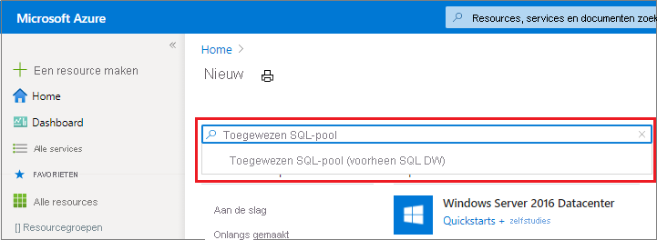
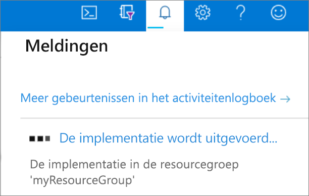

# <a name="quickstart-create-and-query-a-synapse-sql-pool-using-the-azure-portal"></a>Quick Start: een Synapse SQL-groep maken en er query's op uitvoeren met behulp van de Azure Portal

Maak en zoek snel een Synapse SQL-pool (Data Warehouse) in azure Synapse Analytics (voorheen SQL DW) met behulp van de Azure Portal.

## <a name="prerequisites"></a>Vereisten

1. Als u nog geen abonnement op Azure hebt, maak dan een [gratis](https://azure.microsoft.com/free/) account aan voordat u begint.

   > [!NOTE]
   > Het maken van een SQL-groep in azure Synapse kan resulteren in een nieuwe factureer bare service. Zie [prijzen voor Azure Synapse Analytics](https://azure.microsoft.com/pricing/details/synapse-analytics/)voor meer informatie.

2. Download en installeer de nieuwste versie van [SSMS](/sql/ssms/download-sql-server-management-studio-ssms?toc=/azure/synapse-analytics/sql-data-warehouse/toc.json&bc=/azure/synapse-analytics/sql-data-warehouse/breadcrumb/toc.json&view=azure-sqldw-latest) (SQL Server Management Studio).

## <a name="sign-in-to-the-azure-portal"></a>Aanmelden bij Azure Portal

Meld u aan bij de [Azure-portal](https://portal.azure.com/).

## <a name="create-a-sql-pool"></a>Een SQL-groep maken

Data warehouses worden gemaakt met behulp van SQL-pool in azure Synapse Analytics. Een SQL-groep wordt gemaakt met een gedefinieerde set [reken resources](memory-concurrency-limits.md). De database wordt gemaakt in een [Azure-resourcegroep](../../azure-resource-manager/management/overview.md?toc=/azure/synapse-analytics/sql-data-warehouse/toc.json&bc=/azure/synapse-analytics/sql-data-warehouse/breadcrumb/toc.json) en in een [logische Azure SQL-server](../../sql-database/sql-database-servers.md?toc=/azure/synapse-analytics/sql-data-warehouse/toc.json&bc=/azure/synapse-analytics/sql-data-warehouse/breadcrumb/toc.json).

Volg deze stappen om een SQL-groep te maken die de **AdventureWorksDW** -voorbeeld gegevens bevat.

1. Selecteer in de linkerbovenhoek van de Azure Portal **een resource maken** .

   

2. Selecteer **data bases** op de pagina **Nieuw** en selecteer **Azure Synapse Analytics (voorheen SQL DW)** in de lijst met **Aanbevolen** .

   

3. Geef in **basis principes**uw abonnement, resource groep, naam van SQL-groep en server naam op:

   | Instelling | Voorgestelde waarde | Beschrijving |
   | :------ | :-------------- | :---------- |
   | **Abonnement** | Uw abonnement | Zie [Abonnementen](https://account.windowsazure.com/Subscriptions) voor meer informatie over uw abonnementen. |
   | **Resourcegroep** | myResourceGroup | Zie [Naming conventions](/azure/architecture/best-practices/resource-naming?toc=/azure/synapse-analytics/sql-data-warehouse/toc.json&bc=/azure/synapse-analytics/sql-data-warehouse/breadcrumb/toc.json) (Naamgevingsconventies) voor geldige namen van resourcegroepen. |
   | **Naam van SQL-groep** | Een wereld wijd unieke naam (een voor beeld is *mySampleDataWarehouse*) | Zie [Data Base-id's](/sql/relational-databases/databases/database-identifiers?toc=/azure/synapse-analytics/sql-data-warehouse/toc.json&bc=/azure/synapse-analytics/sql-data-warehouse/breadcrumb/toc.json&view=azure-sqldw-latest)voor geldige database namen. Opmerking: een SQL-pool is een type Data Base. |
   | **Server** | Een wereldwijd unieke naam | Selecteer bestaande server of maak een nieuwe server naam. Selecteer **nieuwe maken**. Zie [Naming conventions](/azure/architecture/best-practices/resource-naming?toc=/azure/synapse-analytics/sql-data-warehouse/toc.json&bc=/azure/synapse-analytics/sql-data-warehouse/breadcrumb/toc.json) (Naamgevingsconventies) voor geldige servernamen. |

   

4. Onder **prestatie niveau**selecteert u **prestatie niveau selecteren** om uw configuratie optioneel te wijzigen met een schuif regelaar.

     

   Zie [Compute beheren in Azure SQL Data Warehouse](sql-data-warehouse-manage-compute-overview.md)voor meer informatie over prestatie niveaus.

5. Nu u het tabblad basis principes van het formulier Azure Synapse Analytics hebt voltooid, selecteert u **controleren + maken** en vervolgens **maken** om de SQL-groep te maken. De inrichting duurt een paar minuten.

   

   

6. Selecteer op de werk balk **meldingen** om het implementatie proces te bewaken.

   

## <a name="create-a-server-level-firewall-rule"></a>Een serverfirewallregel maken

De Azure Synapse-service maakt een firewall op server niveau. Deze firewall voor komt dat externe toepassingen en hulpprogram ma's verbinding maken met de server of data bases op de server. Als u de connectiviteit wilt inschakelen, kunt u firewallregels toevoegen waarmee connectiviteit voor bepaalde IP-adressen wordt ingeschakeld. Volg deze stappen om een [firewallregel op serverniveau](../../sql-database/sql-database-firewall-configure.md?toc=/azure/synapse-analytics/sql-data-warehouse/toc.json&bc=/azure/synapse-analytics/sql-data-warehouse/breadcrumb/toc.json) te maken voor het IP-adres van uw client.

> [!NOTE]
> Azure Synapse communiceert via poort 1433. Als u verbinding wilt maken vanuit een bedrijfsnetwerk, is uitgaand verkeer via poort 1433 mogelijk niet toegestaan vanwege de firewall van het netwerk. In dat geval kunt u geen verbinding maken met uw Azure SQL Database-server, tenzij de IT-afdeling poort 1433 openstelt.

1. Nadat de implementatie is voltooid, selecteert u **alle services** in het linkermenu. Selecteer **data bases**, selecteer de ster naast **Azure Synapse Analytics** om Azure Synapse Analytics toe te voegen aan uw favorieten.

2. Selecteer **Azure Synapse Analytics** in het menu aan de linkerkant en selecteer vervolgens **mySampleDataWarehouse** op de pagina **Azure Synapse Analytics** . De overzichts pagina voor de data base wordt geopend, met de volledig gekwalificeerde server naam (zoals **sqlpoolservername.database.Windows.net**) en biedt opties voor verdere configuratie.

3. Kopieer deze volledig gekwalificeerde server naam om te gebruiken om verbinding te maken met uw server en de bijbehorende data bases in deze en andere Quick starts. Selecteer de server naam om de server instellingen te openen.

   

4. Selecteer **firewall instellingen weer geven**.

   

5. De pagina **firewall instellingen** voor de SQL database-server wordt geopend.

   

6. Selecteer **client-IP toevoegen** op de werk balk om uw huidige IP-adres toe te voegen aan een nieuwe firewall regel. Een firewallregel kan poort 1433 openen voor een afzonderlijk IP-adres of voor een aantal IP-adressen.

7. Selecteer **Opslaan**. Er wordt een firewallregel op serverniveau gemaakt voor uw huidige IP-adres waarbij poort 1433 op de logische server wordt geopend.

8. Selecteer **OK** en sluit vervolgens de pagina **firewall instellingen** .

U kunt nu verbinding maken met de SQL-Server en de bijbehorende SQL-groepen met dit IP-adres. De verbinding werkt met SQL Server Management Studio of een ander hulpprogramma van uw keuze. Wanneer u verbinding maakt, gebruikt u het ServerAdmin-account dat u eerder hebt gemaakt.

> [!IMPORTANT]
> Voor alle Azure-services is toegang via de SQL Database-firewall standaard ingeschakeld. Selecteer **uit** op deze pagina en selecteer vervolgens **Opslaan** om de firewall voor alle Azure-Services uit te scha kelen.

## <a name="get-the-fully-qualified-server-name"></a>De volledig gekwalificeerde servernaam ophalen

Haal de volledig gekwalificeerde servernaam van uw SQL-server op uit Azure Portal. Later gebruikt u de volledig gekwalificeerde servernaam bij het verbinding maken met de server.

1. Meld u aan bij de [Azure-portal](https://portal.azure.com/).

2. Selecteer **Azure Synapse Analytics** in het menu aan de linkerkant en selecteer op de pagina **Azure Synapse Analytics** .

3. In het deelvenster **Essentials** van de Azure Portal-pagina van uw database kopieert u de **servernaam**. In dit voor beeld is de volledig gekwalificeerde naam sqlpoolservername.database.windows.net.

    

## <a name="connect-to-the-server-as-server-admin"></a>Als serverbeheerder verbinding maken met de server

In deze sectie wordt gebruikgemaakt van [SSMS](/sql/ssms/download-sql-server-management-studio-ssms?toc=/azure/synapse-analytics/sql-data-warehouse/toc.json&bc=/azure/synapse-analytics/sql-data-warehouse/breadcrumb/toc.json&view=azure-sqldw-latest) (SQL Server Management Studio) om een verbinding tot stand te brengen met de Azure SQL-server.

1. Open SQL Server Management Studio.

2. Voer in het dialoogvenster **Verbinding maken met server** de volgende informatie in:

   | Instelling | Voorgestelde waarde | Beschrijving |
   | :------ | :-------------- | :---------- |
   | Servertype | Database-engine | Deze waarde is verplicht |
   | Servernaam | De volledig gekwalificeerde servernaam | Hier volgt een voor beeld: **sqlpoolservername.database.Windows.net**. |
   | Verificatie | SQL Server-verificatie | SQL-verificatie is het enige verificatietype dat in deze zelfstudie is geconfigureerd. |
   | Aanmelden | Het beheerdersaccount voor de server | Account dat u hebt opgegeven tijdens het maken van de server. |
   | Wachtwoord | Het wachtwoord voor het beheerdersaccount voor de server | Het wacht woord dat u hebt opgegeven tijdens het maken van de server. |
   ||||

   

3. Selecteer **verbinding maken**. Het venster Objectverkenner wordt geopend in SQL Server Management Studio.

4. Vouw **Databases** uit in Objectverkenner. Vouw vervolgens **mySampleDatabase** uit om de objecten in uw nieuwe database weer te geven.

   

## <a name="run-some-queries"></a>Een aantal query's uitvoeren

SQL Data Warehouse maakt gebruik van T-SQL als querytaal. Gebruik de volgende stappen om een queryvenster te openen en een aantal T-SQL-query’s uit te voeren:

1. Klik met de rechter muisknop op **mySampleDataWarehouse** en selecteer **nieuwe query**. Een nieuwe queryvenster wordt geopend.

2. Voer in het queryvenster de volgende opdracht in om een lijst met databases te zien.

    ```sql
    SELECT * FROM sys.databases
    ```

3. Selecteer **uitvoeren**. De queryresultaten bevatten twee databases: **hoofd** en **mySampleDataWarehouse**.

   

4. Als u wat gegevens wilt bekijken, gebruikt u de volgende opdracht om het aantal klanten te zien met de achternaam Adams en met drie kinderen. De resultaten bestaan uit zes klanten.

    ```sql
    SELECT LastName, FirstName FROM dbo.dimCustomer
    WHERE LastName = 'Adams' AND NumberChildrenAtHome = 3;
    ```

   

## <a name="clean-up-resources"></a>Resources opschonen

Er worden kosten in rekening gebracht voor Data Warehouse-eenheden en gegevens die zijn opgeslagen in de SQL-groep. Deze compute- en opslagresources worden apart in rekening gebracht.

- Als u de gegevens in de opslag ruimte wilt bewaren, kunt u de reken proces onderbreken wanneer u de SQL-groep niet gebruikt. Door Compute te onderbreken, worden er alleen kosten in rekening gebracht voor gegevens opslag. U kunt de berekening hervatten wanneer u klaar bent om met de gegevens te werken.

- Als u toekomstige kosten wilt verwijderen, kunt u de SQL-groep verwijderen.

Volg deze stappen om resources op te schonen die u niet meer nodig hebt.

1. Meld u aan bij de [Azure Portal](https://portal.azure.com)en selecteer uw SQL-groep.

   

2. Selecteer de knop **pause** om de berekening te onderbreken. Wanneer de SQL-groep is onderbroken, ziet u een knop **hervatten** . Als u de compute wilt hervatten, selecteert u **hervatten**.

3. Selecteer **verwijderen**om de SQL-groep te verwijderen, zodat er geen kosten in rekening worden gebracht voor berekenen of opslag.

4. Als u de door u gemaakte SQL-Server wilt verwijderen, selecteert u **sqlpoolservername.database.Windows.net** in de vorige installatie kopie en selecteert u vervolgens **verwijderen**. Wees voorzichtig met verwijderen. Als u de server verwijdert, worden ook alle databases verwijderd die zijn toegewezen aan de server.

5. Als u de resource groep wilt verwijderen, selecteert u **myResourceGroup**en selecteert u **resource groep verwijderen**.

## <a name="next-steps"></a>Volgende stappen

Voor meer informatie over het laden van gegevens in de SQL-groep gaat u naar het artikel [gegevens laden in SQL-groep](load-data-from-azure-blob-storage-using-polybase.md) .
