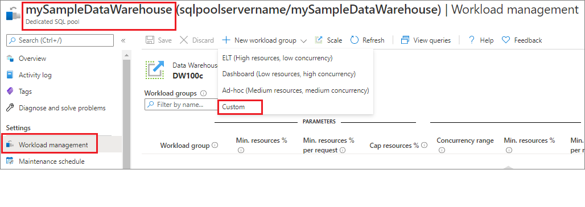

# Snelstartgids: Synapse van de SQL-groep configureren met behulp van een werkbelasting groep in de Azure Portal

In deze Quick start gaat u de [isolatie van werk belasting](sql-data-warehouse-workload-isolation.md) configureren door een werkbelasting groep te maken voor het reserveren van resources.  In het kader van deze zelf studie maken we de werkbelasting groep voor het laden `DataLoads`van gegevens. Voor de werkbelasting groep worden 20% van de systeem resources gereserveerd.  Met een isolatie van 20% voor het laden van gegevens, zijn dit gegarandeerde bronnen waarmee ze kunnen voldoen aan de Sla's.  Nadat u de werkbelasting groep hebt gemaakt, [maakt u een werkbelasting classificatie](quickstart-create-a-workload-classifier-portal.md) om query's toe te wijzen aan deze werkbelasting groep.

Als u nog geen abonnement op Azure hebt, maak dan een [gratis](https://azure.microsoft.com/free/) account aan voordat u begint.

## Aanmelden bij Azure Portal

Meld u aan bij [Azure Portal](https://portal.azure.com/).

> [!NOTE]
> Het maken van een exemplaar van een SQL-groep in azure Synapse Analytics kan resulteren in een nieuwe factureer bare service.  Zie [prijzen voor Azure Synapse Analytics](https://azure.microsoft.com/pricing/details/sql-data-warehouse/)voor meer informatie.

## Vereisten

In deze Quick Start wordt ervan uitgegaan dat u al een exemplaar van de SQL-groep hebt in Synapse SQL en dat u de machtigingen voor de Data Base hebt beheerd. Gebruik [Maken en verbinden - portal](create-data-warehouse-portal.md) om een datawarehouse met de naam **mySampleDataWarehouse** te maken.

>[!IMPORTANT] 
>Uw SQL-groep moet online zijn voor het configureren van het beheer van de werk belasting. 

## Isolatie van werk belasting configureren
Resources van SQL-pool kunnen worden geïsoleerd en gereserveerd voor specifieke werk belastingen door werkbelasting groepen te maken.  Raadpleeg de documentatie over de [isolatie van werk belasting](sql-data-warehouse-workload-isolation.md) voor meer informatie over hoe werkbelasting groepen u helpen bij het beheren van uw werk belasting.  De Snelstartgids [maken en verbinden-Portal](create-data-warehouse-portal.md) heeft **mySampleDataWarehouse** gemaakt en geïnitialiseerd met 400 dwu's. In de volgende stappen maakt u een werkbelasting groep in **mySampleDataWarehouse**.

Een werkbelasting groep maken met een isolatie van 20%:
1.  Klik op **Azure Synapse Analytics (voorheen SQL DW)** op de linker pagina van de Azure Portal.
2.  Selecteer **mySampleDataWarehouse** op de pagina **Azure Synapse Analytics (voorheen SQL DW)** . De SQL-groep wordt geopend.
3.  Klik op **workload Management**.
4.  Klik op **nieuwe werkbelasting groep**.
5.  Klik op **aangepast**.

    

6.  Voer `DataLoads` in voor de **werkbelasting groep**.
7.  Voer `20` in voor **min. resources%**.
8.  Voer `5` voor **min. resources% per aanvraag**in.
9.  Invoeren `100` voor **Cap-resources%**.
10.   Klik op **Opslaan**.

   

Er wordt een portal melding weer gegeven wanneer de werkbelasting groep wordt gemaakt.  De resources van de werkbelasting groep worden weer gegeven in de grafieken onder de geconfigureerde waarden.

   

## Resources opschonen

De `DataLoads` werkbelasting groep die in deze zelf studie is gemaakt, verwijderen:
1. Klik **`...`** aan de rechter kant van de `DataLoads` werkbelasting groep.
2. Klik op **werkbelasting groep verwijderen**.
3. Klik op **Ja** wanneer u wordt gevraagd het verwijderen van de werkbelasting groep te bevestigen.
4. Klik op **Opslaan**.

   

Er worden kosten in rekening gebracht voor Data Warehouse-eenheden en gegevens die zijn opgeslagen in uw data warehouse. Deze compute- en opslagresources worden apart in rekening gebracht.

- Als u de gegevens in de opslag wilt houden, kunt u het berekenen onderbreken wanneer u het datawarehouse niet gebruikt. Door Compute te onderbreken, worden er alleen kosten in rekening gebracht voor gegevens opslag. Wanneer u klaar bent om met de gegevens te werken, hervat u de compute.
- Als u in de toekomst geen kosten meer wilt hebben, kunt u de datawarehouse verwijderen.

Volg deze stappen om resources op te schonen.

1. Meld u aan bij de [Azure Portal](https://portal.azure.com)en selecteer uw data warehouse.

    

2. Selecteer de knop **pause** om de berekening te onderbreken. Als het datawarehouse is onderbroken, ziet u een knop **Start**.  Selecteer **Start**om de compute te hervatten.

3. Als u het Data Warehouse wilt verwijderen zodat er geen kosten in rekening worden gebracht voor berekenen of opslaan, selecteert u **verwijderen**.

4. Als u de door u gemaakte SQL-Server wilt verwijderen, selecteert u **sqlpoolservername.database.Windows.net** in de vorige installatie kopie en selecteert u vervolgens **verwijderen**.  Wees voorzichtig met verwijderen. Als u de server verwijdert, worden ook alle databases verwijderd die zijn toegewezen aan de server.

5. Als u de resource groep wilt verwijderen, selecteert u **myResourceGroup**en selecteert u **resource groep verwijderen**.

## Volgende stappen

Als u de `DataLoads` werkbelasting groep wilt gebruiken, moet de classificatie van de [werk belasting](/sql/t-sql/statements/create-workload-classifier-transact-sql?toc=/azure/synapse-analytics/sql-data-warehouse/toc.json&bc=/azure/synapse-analytics/sql-data-warehouse/breadcrumb/toc.json&view=azure-sqldw-latest) worden gemaakt om aanvragen naar de werkbelasting groep te routeren.  Ga door naar de zelf studie [werk belasting classificatie maken](quickstart-create-a-workload-classifier-portal.md) om een classificatie `DataLoads`voor de werk belasting voor te maken.

## Zie tevens
Zie het artikel [workload management beheren en bewaken](sql-data-warehouse-how-to-manage-and-monitor-workload-importance.md) voor meer informatie over het bewaken van workloads voor workload management.
