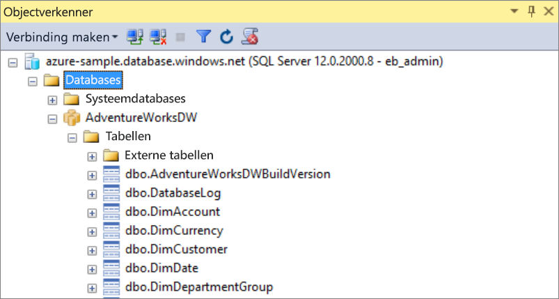
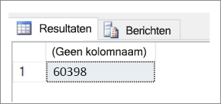

# <a name="connect-to-azure-synapse-analytics-with-sql-server-management-studio-ssms"></a>Verbinding maken met Azure Synapse Analytics met SQL Server Management Studio (SSMS)

> [!div class="op_single_selector"]
>
> * [Power BI](sql-data-warehouse-get-started-visualize-with-power-bi.md)
> * [Azure Machine Learning](sql-data-warehouse-get-started-analyze-with-azure-machine-learning.md)
> * [Visual Studio](sql-data-warehouse-query-visual-studio.md)
> * [sqlcmd](sql-data-warehouse-get-started-connect-sqlcmd.md)
> * [SSMS](sql-data-warehouse-query-ssms.md)

Gebruik SQL Server Management Studio (SSMS) om verbinding te maken met en een query uit te brengen op een Data Warehouse in azure Synapse.

## <a name="prerequisites"></a>Vereisten

Voor deze zelfstudie hebt u het volgende nodig:

* Een bestaande SQL-groep. Zie [Een SQL-pool maken](create-data-warehouse-portal.md) voor informatie over het maken van een datawarehouse.
* SQL Server Management Studio (SSMS) is geïnstalleerd. [Down load SSMS](/sql/ssms/download-sql-server-management-studio-ssms?toc=/azure/synapse-analytics/sql-data-warehouse/toc.json&bc=/azure/synapse-analytics/sql-data-warehouse/breadcrumb/toc.json&view=azure-sqldw-latest) gratis als u dit nog niet hebt gedaan.
* De volledig gekwalificeerde SQL-servernaam. Zie [verbinding maken met de SQL-groep](sql-data-warehouse-connect-overview.md)om deze informatie te vinden.

## <a name="1-connect-to-your-sql-pool"></a>1. Maak verbinding met de SQL-groep

1. Open SQL Server Management Studio.
2. Open objectverkenner door **bestand**  >  **Connect objectverkenner**te selecteren.

    
3. Vul de velden in het venster Connect to Server (Verbinding maken met server) in.

   

   * **Server naam**. Voer de eerder vastgestelde **servernaam** in.
   * **Verificatie**. Selecteer **SQL Server Authentication** (SQL Server-verificatie) of **Active Directory Integrated Authentication** (Geïntegreerde Active Directory-verificatie).
   * **Gebruikers naam** en **wacht woord**. Voer de gebruikersnaam en het wachtwoord in als u hierboven SQL Server-verificatie hebt geselecteerd.
   * Klik op **Verbinden**.
4. U kunt de Azure SQL-server uitvouwen als u deze wilt verkennen. U kunt de databases weergeven die aan de server zijn gekoppeld. Vouw AdventureWorksDW uit als u de tabellen in de voorbeelddatabase wilt zien.

   

## <a name="2-run-a-sample-query"></a>2. Voer een voorbeeld query uit

Nu er een verbinding met uw database is ingesteld, gaat u een query schrijven.

1. Klik met de rechtermuisknop op de database in SQL Server-objectverkenner.
2. Selecteer **New Query** (Nieuwe query). Een nieuwe queryvenster wordt geopend.

   
3. Kopieer de volgende T-SQL-query in het queryvenster:

   ```sql
   SELECT COUNT(*) FROM dbo.FactInternetSales;
   ```

4. Voer de query uit door te klikken `Execute` of de volgende snelkoppeling te gebruiken: `F5` .

   
5. Bekijk de resultaten van de query. In dit voorbeeld heeft de tabel FactInternetSales 60398 rijen.

   

## <a name="next-steps"></a>Volgende stappen

Nu u weet hoe u verbinding maakt en een query uitvoert, kunt u proberen [de gegevens te visualiseren met Power BI](sql-data-warehouse-get-started-visualize-with-power-bi.md). Zie [verifiëren bij SQL-groep](sql-data-warehouse-authentication.md)om uw omgeving te configureren voor Azure Active Directory-verificatie.
