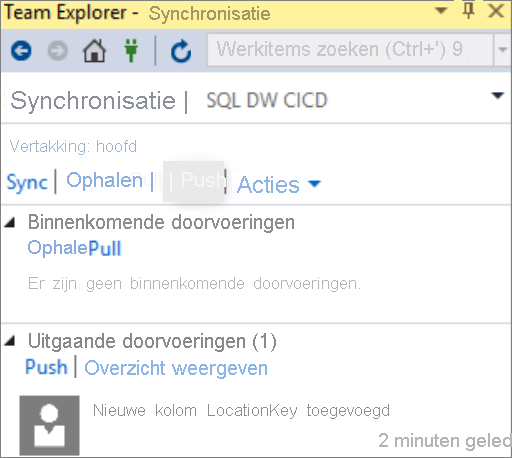

# Integratie van broncodebeheer voor SQL-pool

In deze zelfstudie leert u hoe u uw SQL Server Data Tools (SSDT)-databaseproject integreert met broncodebeheer.  Integratie met broncodebeheer is de eerste stap voor het bouwen van een doorlopende integratie- en implementatiepijplijn met de SQL-poolresource in Azure Synapse Analytics.

## Voordat u begint

- Meld u aan voor een [Azure DevOps-organisatie](https://azure.microsoft.com/services/devops/)
- Voltooi de zelfstudie [Maken en koppelen](create-data-warehouse-portal.md)
- [Installeer Visual Studio 2019](https://visualstudio.microsoft.com/vs/older-downloads/)

## Instellen van en verbinding maken met Azure DevOps

1. Maak in uw Azure DevOps-organisatie een project voor het hosten van uw SSDT-databaseproject via een Azure-opslagplaats

   

2. Open Visual Studio en selecteer Verbindingen beheren om verbinding te maken met uw Azure DevOps-organisatie en project uit stap 1

   

   

3. Uw Azure-opslagplaats klonen vanuit uw project naar uw lokale machine

   

## Uw project maken en ermee verbinding maken

1. Maak in Visual Studio een nieuw SQL Server-databaseproject met zowel een map als een lokale Git-opslag plaats in uw **lokaal gekloonde opslagplaats**

     

2. Klik met de rechtermuisknop op uw lege sqlproject en importeer uw datawarehouse in het databaseproject

     

3. Voer in Team Explorer in Visual Studio alle wijzigingen in uw lokale Git-opslagplaats door

     

4. Nu u de wijzigingen lokaal hebt doorgevoerd in de gekloonde opslagplaats, synchroniseert u uw wijzigingen met en pusht u ze naar uw Azure-opslagplaats in uw Azure DevOps-project.

   

     

## Validatie

1. Controleer of de wijzigingen zijn gepusht naar uw Azure -opslagplaats door een tabelkolom in uw databaseproject bij te werken vanuit Visual Studio SQL Server Data Tools (SSDT)

   

2. Voer de wijziging door en push die van uw lokale opslagplaats naar uw Azure-opslagplaats

   

3. Controleer of de wijziging naar uw Azure-opslagplaats is gepusht

   

4. (**Optioneel**) Gebruik schemavergelijking en werk de wijzigingen in uw doel-datawarehouse bij met SSDT om ervoor te zorgen dat de objectdefinities in uw Azure-opslagplaats en lokale opslagplaats overeenkomen met uw datawarehouse

## Volgende stappen

- [Ontwikkelen voor SQL-pool](sql-data-warehouse-overview-develop.md)
