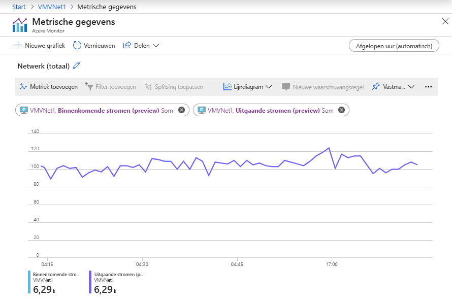

# Virtuele machine netwerkbandbreedte

Azure biedt tal van VM-grootten en -typen, elk met een andere combinatie van prestaties levert. Een mogelijkheid is netwerk doorvoer (of bandbreedte), gemeten in megabits per seconde (Mbps). Omdat virtuele machines worden gehost op gedeelde hardware, moet de netwerkcapaciteit redelijk worden gedeeld met de virtuele machines delen dezelfde hardware. Grotere virtuele machines zijn relatief meer bandbreedte dan kleinere virtuele machines toegewezen.
 
De bandbreedte van het netwerk toegewezen aan elke virtuele machine wordt gemeten op de uitgaande gegevens (uitgaand) verkeer van de virtuele machine. Alle netwerkverkeer verlaten van de virtuele machine wordt meegeteld voor de limiet van de toegewezen, ongeacht de bestemming. Bijvoorbeeld, als een virtuele machine een limiet van 1000 Mbps heeft, geldt dat een limiet of het uitgaande verkeer bestemd voor een andere virtuele machine in hetzelfde virtuele netwerk en buiten Azure is.
 
Inkomend verkeer wordt niet gemeten of die beperkt zijn rechtstreeks. Er zijn echter andere factoren, zoals CPU- en opslaglimieten die kunnen van invloed op de mogelijkheid van een virtuele machine voor het verwerken van inkomende gegevens.

Versneld netwerken is een functie die is ontworpen voor betere prestaties van het netwerk, met inbegrip van latentie, doorvoer en CPU-gebruik. Terwijl versneld netwerken de doorvoer van een virtuele machine verbeteren kan, deze mogelijk alleen up wordt gemaakt op de virtuele machine bandbreedte toegewezen. Zie voor meer informatie over versnelde netwerken, versneld netwerken voor [Windows](create-vm-accelerated-networking-powershell.md) of [Linux](create-vm-accelerated-networking-cli.md) virtuele machines.
 
Virtuele machines van Azure, moet een, maar kan er meerdere, netwerkinterfaces die zijn gekoppeld aan deze hebben. Bandbreedte die is toegewezen aan een virtuele machine is de som van al het uitgaande verkeer voor alle netwerkinterfaces die zijn gekoppeld aan een virtuele machine. Met andere woorden, is de toegewezen bandbreedte per virtuele machine, ongeacht het aantal netwerkinterfaces zijn gekoppeld aan de virtuele machine. Zie voor meer het aantal netwerkinterfaces van verschillende Azure-VM-grootten ondersteuning Azure [Windows](../virtual-machines/windows/sizes.md?toc=%2fazure%2fvirtual-network%2ftoc.json) en [Linux](../virtual-machines/linux/sizes.md?toc=%2fazure%2fvirtual-network%2ftoc.json) VM-grootten. 

## Verwachte netwerkdoorvoer

Verwachte uitgaande doorvoer en het aantal netwerkinterfaces dat wordt ondersteund door elke VM-grootte wordt beschreven in Azure [Windows](../virtual-machines/windows/sizes.md?toc=%2fazure%2fvirtual-network%2ftoc.json) en [Linux](../virtual-machines/linux/sizes.md?toc=%2fazure%2fvirtual-network%2ftoc.json) VM-grootten. Selecteer een type, zoals algemeen gebruik, en selecteer vervolgens een grootte-serie op de resulterende pagina, zoals de Dv2-serie. Elke reeks bevat een tabel met netwerken specificaties in de laatste kolom met de titel **max. aantal NIC's / verwachte netwerkprestaties (Mbps)** . 

De maximale doorvoer is van toepassing op de virtuele machine. Doorvoer wordt niet beïnvloed door de volgende factoren:
- **Het aantal netwerkinterfaces**: De limiet voor bandbreedte is cumulatieve van al het uitgaande verkeer van de virtuele machine.
- **Versnelde netwerken**: Hoewel de functie handig is bij het bereiken van de gepubliceerde limiet, verandert de limiet niet meer.
- **Het doel van verkeer**: Alle bestemmingen tellen mee voor de limiet voor uitgaande.
- **Protocol**: Al het uitgaande verkeer via alle protocollen telt voor de limiet.

## Limieten voor netwerk-stroom

Naast de bandbreedte, het aantal netwerkverbindingen aanwezig zijn op een virtuele machine op een bepaald moment kan invloed hebben op de prestaties van het netwerk. De Azure-netwerkstack status voor elke richting van een TCP/UDP-verbinding in met de naam 'stromen' gegevensstructuren bijgehouden. Een typische TCP/UDP-verbinding heeft 2 stromen die worden gemaakt, een voor het inkomende en een voor de uitgaande richting. 

Gegevensoverdracht tussen de eindpunten is vereist voor het maken van verschillende stromen naast die de gegevensoverdracht. Enkele voorbeelden zijn stromen die worden gemaakt voor DNS-omzetting en stromen die worden gemaakt voor de load balancer-tests. Houd er rekening mee dat virtuele netwerkapparaten (NVA's), zoals gateways, proxy's, firewalls, zien ook stromen voor verbindingen op het apparaat beëindigd en afkomstig is van het apparaat wordt gemaakt. 

## Stroom limieten en aanbevelingen

Vandaag de dag ondersteunt de Azure-netwerkstack 250 kB totale netwerk stromen met goede prestaties voor virtuele machines met meer dan 8 CPU-kernen en 100 k totaal aantal stromen met goede prestaties voor virtuele machines met minder dan 8 CPU-kernen. Na dit netwerk limiet prestaties minder probleemloos voor extra stromen tot een vaste limiet van 1 miljoen totale stromen, 500 K binnenkomend en 500 K uitgaande na welke extra stromen worden verwijderd.

||Virtuele machines met < 8 CPU-kernen|Virtuele machines met 8 + CPU-kernen|
|---|---|---|
|<b>Goede prestaties</b>|100K stromen |250K stromen|
|<b>Verminderde prestaties</b>|100 k stromen|Hierboven 250 kB stromen|
|<b>Limiet voor stroom</b>|1M stromen|1M stromen|

Metrische gegevens zijn beschikbaar in [Azure Monitor](../azure-monitor/platform/metrics-supported.md#microsoftcomputevirtualmachines) voor het bijhouden van het aantal stromen netwerk en de stroom maken op uw virtuele machine of VMSS-instanties.

Verbinding tot stand brengen en beëindiging tarieven kunnen ook van invloed op de prestaties van het netwerk als de verbinding tot stand brengen en beëindiging CPU met deelt pakket verwerking routines. Het is raadzaam dat u workloads op de verwachte verkeerspatronen en scale-out werkbelastingen op de juiste wijze benchmark zodat deze overeenkomt met uw prestatiebehoeften. 

## Volgende stappen

- [Netwerkdoorvoer optimaliseren voor het besturingssysteem van een virtuele machine](virtual-network-optimize-network-bandwidth.md)
- [Test de netwerkdoorvoer](virtual-network-bandwidth-testing.md) voor een virtuele machine.
