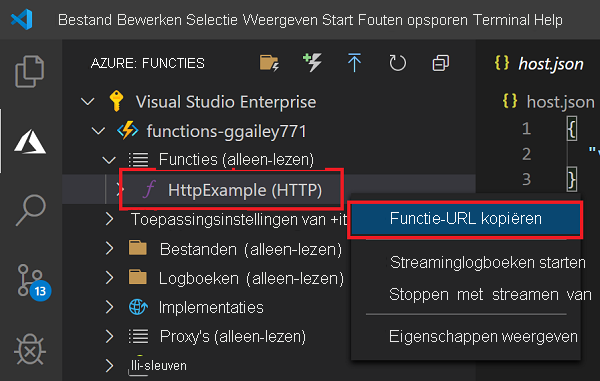

## <a name="run-the-function-in-azure"></a>De functie in Azure uitvoeren

1. Ga terug naar **Azure: Functions** en vouw in de zijbalk de nieuwe functie-app uit onder uw abonnement. Vouw **Functies** uit, klik met de rechtermuisknop (Windows) of <kbd>Ctrl -</kbd> klik (macOS) op **HttpExample** en kies vervolgens **Functie-URL kopiëren**.

    

1. Plak deze URL voor de HTTP-aanvraag in de adresbalk van uw browser, voeg de `name`queryreeks toe als `?name=Functions` aan het einde van deze URL en voer de aanvraag uit. De URL die uw HTTP-geactiveerde functie aanroept, moet de volgende indeling hebben:

    ```http
    http://<FUNCTION_APP_NAME>.azurewebsites.net/api/HttpExample?name=Functions
    ```

    U ziet in het volgende voorbeeld het antwoord op de externe GET-aanvraag dat door de functie wordt geretourneerd, weergegeven in de browser:

    
