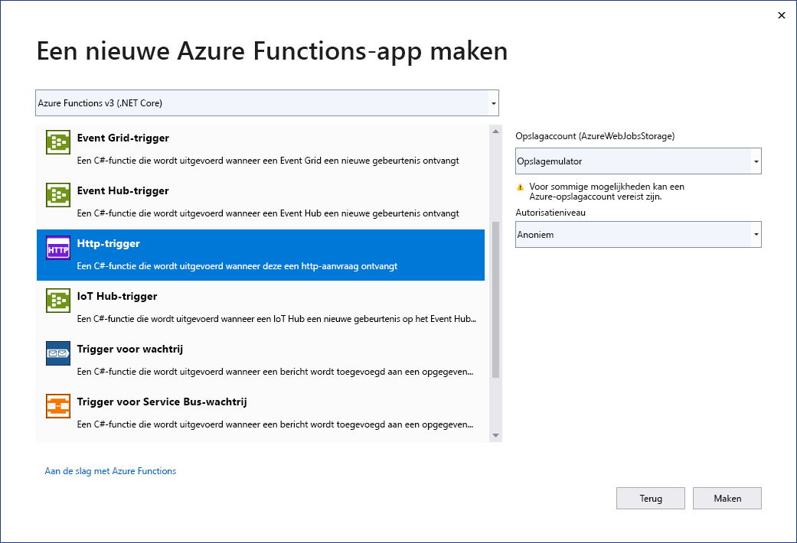

De projectsjabloon Azure Functions in Visual Studio maakt een project dat u publiceren naar een functie-app in Azure. U een functie-app gebruiken om functies te groeperen als een logische eenheid voor eenvoudiger beheer, implementatie, schalen en delen van resources.

1. Selecteer **Bestand** > **nieuw** > **project**in het menu Visual Studio .

1. Voer **in Een nieuw project maken** *functies* in het zoekvak in, kies de sjabloon **Azure-functies** en selecteer **Volgende**.

1. Voer in **Uw nieuwe project configureren**een **projectnaam** voor uw project in en selecteer **Vervolgens Maken**. De functie-appnaam moet geldig zijn als een C#-naamruimte. Gebruik dus geen onderstrepingstekens, afbreekstreepjes of andere niet-alfanumerieke tekens.

1. Gebruik de waarden in de volgende tabel voor de instellingen **voor een nieuwe Azure-functietoepassing** maken:

    | Instelling      | Waarde  | Beschrijving                      |
    | ------------ |  ------- |----------------------------------------- |
    | **Runtime van functies** | **Azure-functies  v2 (.NET-kern)** | Met deze waarde wordt een functieproject gemaakt dat gebruik maakt van de uitvoering van versie 2.x van Azure-functies, die .NET Core ondersteunt. Azure Functions 1.x ondersteunt .NET Framework. Zie [overzicht van azure functions runtime-versies](../articles/azure-functions/functions-versions.md)voor meer informatie.   |
    | **Functiesjabloon** | **HTTP-trigger** | Met deze waarde wordt een functie geactiveerd door een HTTP-aanvraag. |
    | **Opslagaccount**  | **Opslagemulator** | Omdat een Azure-functie een opslagaccount vereist, wordt er een toegewezen of gemaakt wanneer u uw project publiceert naar Azure. Een HTTP-trigger maakt geen gebruik van een tekenreeks voor azure-opslagaccountverbindingen. alle andere triggertypen vereisen een geldige azure storage-verbindingstekenreeks.  |
    | **Toegangsrechten** | **Anoniem** | De gemaakte functie kan door iedere client worden geactiveerd zonder een sleutel op te geven. Met deze autorisatie-instelling kunt u eenvoudig uw nieuwe functie testen. Zie [Autorisatiesleutels](../articles/azure-functions/functions-bindings-http-webhook-trigger.md#authorization-keys) en [HTTP- en webhookbindingen](../articles/azure-functions/functions-bindings-http-webhook.md)voor meer informatie over sleutels en autorisatie. |
    

    
    

    Zorg ervoor dat u de **toegangsrechten** instelt op **Anoniem**. Als u het standaardfunctieniveau **kiest,** moet u de [functiesleutel](../articles/azure-functions/functions-bindings-http-webhook-trigger.md#authorization-keys) weergeven in aanvragen om toegang te krijgen tot het eindpunt van de functie.

1. Selecteer **Maken** om het functieproject en de HTTP-triggerfunctie te maken.
