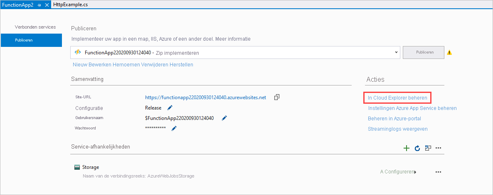

1. Klik in **Solution Explorer** met de rechtermuisknop op het project en selecteer **Publiceren**.

2. Gebruik in **een publicatie doel kiezen**de publicatie opties die zijn opgegeven in de volgende tabel: 

    | Optie      | Beschrijving                                |
    | ------------ |  -------------------------------------------------- |
    | **Azure functie-app** | Een functie-app maken in een Azure-cloud omgeving. | 
    | **Nieuwe maken** | Er wordt een nieuwe functie-app met gerelateerde resources gemaakt in Azure.  Als u **bestaande selecteren**kiest, worden alle bestanden in de bestaande functie-app in azure overschreven door bestanden van het lokale project. Gebruik deze optie alleen wanneer u updates opnieuw publiceert naar een bestaande functie-app. |
    | **Uitvoeren vanuit pakket bestand** | Uw functie-app wordt geïmplementeerd met behulp van [zip-implementatie](../articles/azure-functions/functions-deployment-technologies.md#zip-deploy) met de modus voor [uitvoeren vanaf pakket](../articles/azure-functions/run-functions-from-deployment-package.md) ingeschakeld. Deze implementatie, wat resulteert in betere prestaties, is de aanbevolen manier om uw functies uit te voeren.  Als u deze optie niet gebruikt, moet u ervoor zorgen dat uw functie-app-project niet lokaal wordt uitgevoerd voordat u naar Azure publiceert. |

    

3. Selecteer **publiceren**. Als u zich nog niet hebt aangemeld bij uw Azure-account vanuit Visual Studio, selecteert u **Aanmelden**. U kunt ook een gratis Azure-account maken.

4. In **Azure app service: nieuwe maken**, gebruikt u de waarden die zijn opgegeven in de volgende tabel:

    | Instelling      | Waarde  | Beschrijving                                |
    | ------------ |  ------- | -------------------------------------------------- |
    | **Naam** | Wereldwijd unieke naam | Naam waarmee uw nieuwe functie-app uniek wordt aangeduid. Accepteer deze naam of voer een nieuwe naam in. Geldige tekens zijn: `a-z`, `0-9`en `-`. |
    | **Abonnement** | Uw abonnement | Het te gebruiken Azure-abonnement. Accepteer dit abonnement of selecteer een nieuwe in de vervolg keuzelijst. |
    | **[Resource groep](../articles/azure-resource-manager/management/overview.md)** | Naam van de resource groep |  De resource groep waarin u de functie-app wilt maken. Selecteer een bestaande resource groep in de vervolg keuzelijst of kies **Nieuw** om een nieuwe resource groep te maken.|
    | **[Hosting plan](../articles/azure-functions/functions-scale.md)** | De naam van het hosting abonnement | Selecteer **Nieuw** om een serverloos abonnement te configureren. Zorg ervoor dat u het **verbruik** kiest onder **grootte**. Wanneer u uw project publiceert naar een functie-app die wordt uitgevoerd in een [verbruiks abonnement](../articles/azure-functions/functions-scale.md#consumption-plan), betaalt u alleen voor uitvoeringen van uw functions-app. Andere hosting abonnementen nemen hogere kosten in bestaan. Als u een ander abonnement dan **verbruik**gebruikt, moet u de [schaal van uw functie-app](../articles/azure-functions/functions-scale.md)beheren. Kies een **locatie** in een [regio](https://azure.microsoft.com/regions/) bij u in de buurt of andere services waartoe uw functies toegang hebben.  |
    | **[Azure Storage](../articles/storage/common/storage-account-create.md)** | Opslag account voor algemeen gebruik | Er is een Azure Storage-account vereist voor de runtime van functions. Selecteer **Nieuw** voor het configureren van een opslag account voor algemeen gebruik. U kunt ook een bestaand account kiezen dat voldoet aan de [vereisten voor het opslag account](../articles/azure-functions/functions-scale.md#storage-account-requirements).  |

    

5. Selecteer **maken** om een functie-app en de bijbehorende resources in azure te maken met deze instellingen en om uw functie project code te implementeren. 

6. Selecteer publiceren en nadat de implementatie is voltooid, noteer de waarde van de **site-URL** . Dit is het adres van uw functie-app in Azure.

    
