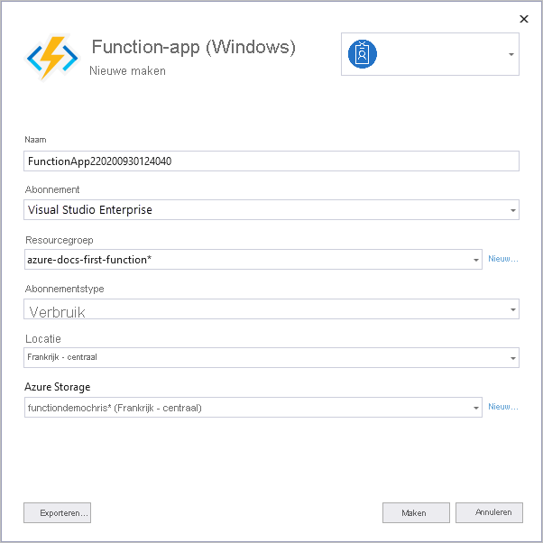

1. Klik in **Solution Explorer** met de rechtermuisknop op het project en selecteer **Publiceren**.

1. In **Doel** selecteert u **Azure** en :::image type="content" source="media/functions-vstools-publish/functions-visual-studio-publish-profile-step-1.png" alt-text="Azure-doel selecteren":::

1. In **Specifiek doel** selecteert u **Azure Functie-app (Windows)**

    :::image type="content" source="media/functions-vstools-publish/functions-visual-studio-publish-profile-step-2.png" alt-text="Selecteer Azure Functie-app":::

1. In **Functie-exemplaar** selecteert u **Een nieuwe Azure-functie maken...** en vervolgens gebruikt u de waarden die in de volgende tabel zijn opgegeven:

    | Instelling      | Waarde  | Beschrijving                                |
    | ------------ |  ------- | -------------------------------------------------- |
    | **Naam** | Wereldwijd unieke naam | Naam waarmee uw nieuwe functie-app uniek wordt aangeduid. Accepteer deze naam of voer een nieuwe in. Geldige tekens zijn `a-z`, `0-9` en `-`. |
    | **Abonnement** | Uw abonnement | Het te gebruiken Azure-abonnement. Accepteer dit abonnement of selecteer een nieuwe uit de vervolgkeuzelijst. |
    | **[Resourcegroep](../articles/azure-resource-manager/management/overview.md)** | Naam van uw resourcegroep |  De resourcegroep waarin uw functie-app moet worden gemaakt. Selecteer een bestaande resourcegroep uit de vervolgkeuzelijst of kies **Nieuwe** om een nieuwe resourcegroep te maken.|
    | **[Abonnemtsype](../articles/azure-functions/functions-scale.md)** | Verbruik | Wanneer u uw project publiceert in een functie-app die wordt uitgevoerd in een [verbruiksabonnement](../articles/azure-functions/functions-scale.md#consumption-plan), betaalt u alleen voor uitvoeringen van uw functie-app. Andere hostingabonnement kosten meer. |
    | **Locatie** | Locatie van de app-service | Kies een **Locatie** in een [regio](https://azure.microsoft.com/regions/) bij u in de buurt of in de buurt van andere services die door uw functies worden gebruikt. |
    | **[Azure Storage](../articles/storage/common/storage-account-create.md)** | Storage-account voor algemeen gebruik | Er is een Azure Storage-account vereist voor de Functions-runtime. Selecteer **Nieuw** om een algemeen opslagaccount te configureren. U kunt ook een bestaand account kiezen dat voldoet aan de [vereisten voor een opslagaccount](../articles/azure-functions/functions-scale.md#storage-account-requirements).  |

    

1. Selecteer **Maken** om een functie-app en de bijbehorende resources te maken in Azure. 
1. Controleer in **Functie-exemplaar** of **Uitvoeren vanuit pakketbestand** is aangevinkt. Uw functie-app wordt geïmplementeerd met [Zip-implementeren](../articles/azure-functions/functions-deployment-technologies.md#zip-deploy) met de modus [Uitvoeren vanuit pakket](../articles/azure-functions/run-functions-from-deployment-package.md) ingeschakeld. Dit is de aanbevolen implementatiemethode voor uw functieproject, aangezien deze leidt tot betere prestaties. 

    :::image type="content" source="media/functions-vstools-publish/functions-visual-studio-publish-profile-step-4.png" alt-text="Profiel maken afronden":::

1. Selecteer **Voltooien** en selecteer op de pagina Publiceren de optie **Publiceren** om het pakket met uw projectbestanden te implementeren in de nieuwe functie-app in Azure. 

    Nadat de implementatie de hoofd0URL van de functie-app voltooid in Azure, wordt deze weergegeven in het tabblad **Publiceren**. 
    
1.  Kies **Beheren in Cloud Explorer** in het tabblad Publiceren. Hiermee wordt de nieuwe Azure-resource van de functie-app geopend in Cloud Explorer. 
    
    :::image type="content" source="media/functions-vstools-publish/functions-visual-studio-publish-complete.png" alt-text="Succesbericht publiceren":::
    
    Met Cloud Explorer kunt u Visual Studio gebruiken om de inhoud van de site te bekijken, de functie-app te starten en stoppen en direct bladeren in resources van de functie-app in Azure en in Azure Portal. 
