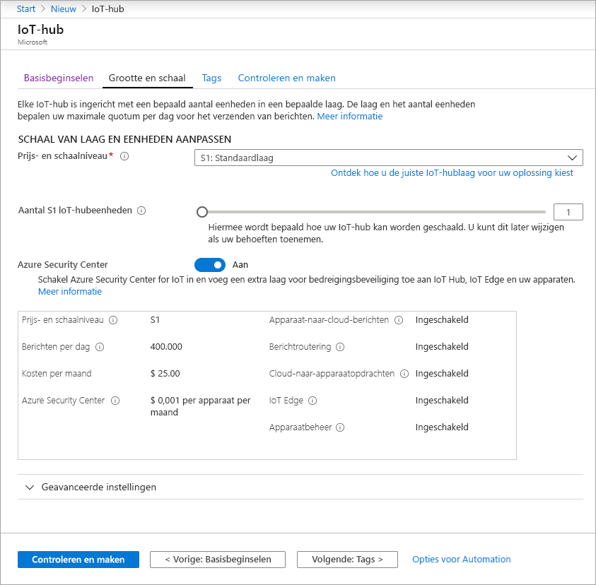

In deze sectie wordt beschreven hoe u een IoT-hub maakt met behulp van de [Azure-portal](https://portal.azure.com).

1. Meld u aan bij [Azure Portal](https://portal.azure.com).

1. Selecteer op de Azure-startpagina de knop **+ Een resource maken** en voer vervolgens *IoT Hub* in het veld Zoeken in de **marketplace.**

1. Selecteer **IoT-hub** in de zoekresultaten en selecteer **Vervolgens Maken**.

1. Vul op het tabblad **Basis** de volgende velden in:

   - **Abonnement:** Selecteer het abonnement dat u wilt gebruiken voor uw hub.

   - **Resourcegroep:** selecteer een resourcegroep of maak een nieuwe groep. Als u een nieuwe wilt maken, selecteert u **Nieuw maken** en vult u de naam in die u wilt gebruiken. Als u een bestaande resourcegroep wilt gebruiken, selecteert u die resourcegroep. Zie [Azure Resource Manager-resourcegroepen beheren](../articles/azure-resource-manager/management/manage-resource-groups-portal.md) voor meer informatie.

   - **Regio**: Selecteer het gebied waarin u wilt dat uw hub zich bevindt. Selecteer de locatie die het dichtst bij u in de buurt is. Sommige functies, zoals [IoT Hub-apparaatstreams,](../articles/iot-hub/iot-hub-device-streams-overview.md)zijn alleen beschikbaar in specifieke regio's. Voor deze beperkte functies moet u een van de ondersteunde regio's selecteren.

   - **IoT-hubnaam:** voer een naam in voor uw hub. Deze naam moet wereldwijd uniek zijn. Als de door u opgegeven naam beschikbaar is, verschijnt er een groen vinkje.

   [!INCLUDE [iot-hub-pii-note-naming-hub](iot-hub-pii-note-naming-hub.md)]

   

1. Selecteer **Volgende: Grootte en schaal** om door te gaan met het maken van uw hub.

   

   U de standaardinstellingen hier accepteren. Indien gewenst u een van de volgende velden wijzigen: 

    - **Prijs- en schaalniveau:** uw geselecteerde laag. U kiezen uit verschillende lagen, afhankelijk van het aantal functies dat u wilt en hoeveel berichten u per dag via uw oplossing verzendt. De gratis optie is bedoeld voor testen en evalueren. Hiermee kunnen 500 apparaten worden aangesloten op de hub en tot 8.000 berichten per dag. Elk Azure-abonnement kan één IoT-hub maken in de gratis laag. 

      Als u via een Quickstart voor IoT Hub-apparaatstreams werkt, selecteert u de gratis laag.

    - **IoT Hub-eenheden**: het aantal toegestane berichten per eenheid is afhankelijk van de prijscategorie van uw hub. Als u bijvoorbeeld wilt dat de hub het binnendringen van 700.000 berichten ondersteunt, kiest u twee S1-laageenheden.
    Zie [De juiste laag kiezen voor uw IoT-hub](../articles/iot-hub/iot-hub-scaling.md) voor informatie over andere opties.

    - **Azure Security Center**: Schakel dit in om een extra laag bedreigingsbeveiliging toe te voegen aan IoT en uw apparaten. Deze optie is niet beschikbaar voor hubs in de gratis laag. Zie Azure Security Center [for IoT voor](https://docs.microsoft.com/azure/asc-for-iot/)meer informatie over deze functie.

    - **Geavanceerde instellingen** > **Device-to-cloud partities**: Deze eigenschap koppelt de device-to-cloud berichten aan het aantal gelijktijdige lezers van de berichten. De meeste hubs hebben slechts vier partities nodig.

1.  Selecteer **Volgende: Tags** om door te gaan naar het volgende scherm.

    Tags zijn naam/waardeparen. U dezelfde tag toewijzen aan meerdere resources en resourcegroepen om resources te categoriseren en facturering te consolideren. Zie [Tags gebruiken om uw Azure-bronnen te ordenen](../articles/azure-resource-manager/management/tag-resources.md)voor meer informatie.

    

1.  Selecteer **Volgende: Bekijken + maken** om uw keuzes te bekijken. U ziet iets vergelijkbaars met dit scherm, maar met de waarden die u hebt geselecteerd bij het maken van de hub. 

    

1.  Selecteer **Maken** om uw nieuwe hub te maken. De hub wordt binnen enkele minuten gemaakt.
