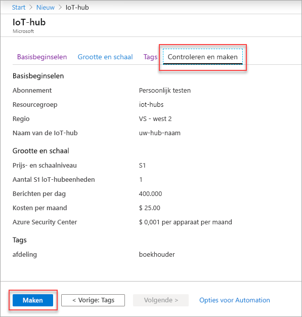

In deze sectie wordt beschreven hoe u een IoT-hub maakt met behulp van de [Azure-portal](https://portal.azure.com).

1. Meld u aan bij de [Azure-portal](https://portal.azure.com).

1. Selecteer in de Azure-start pagina de knop **+ een resource maken** en voer *IOT hub* in het veld **Marketplace doorzoeken** in.

1. Selecteer **IOT hub** in de zoek resultaten en selecteer vervolgens **maken**.

1. Vul op het tabblad **basis beginselen** de volgende velden in:

   - **Abonnement**: Selecteer het abonnement dat u wilt gebruiken voor uw hub.

   - **Resource groep**: Selecteer een resource groep of maak een nieuwe. Als u een nieuw item wilt maken, selecteert u **nieuwe maken** en vult u de naam in die u wilt gebruiken. Als u een bestaande resource groep wilt gebruiken, selecteert u die resource groep. Zie [Azure Resource Manager-resourcegroepen beheren](../articles/azure-resource-manager/management/manage-resource-groups-portal.md) voor meer informatie.

   - **Regio**: Selecteer de regio waarin u de hub wilt plaatsen. Selecteer de locatie die het dichtst bij u ligt. Sommige functies, zoals [streams van IOT Hub apparaten](../articles/iot-hub/iot-hub-device-streams-overview.md), zijn alleen beschikbaar in bepaalde regio's. Voor deze beperkte functies moet u een van de ondersteunde regio's selecteren.

   - **IOT hub naam**: Voer een naam in voor uw hub. Deze naam moet wereldwijd uniek zijn. Als de door u opgegeven naam beschikbaar is, verschijnt er een groen vinkje.

   [!INCLUDE [iot-hub-pii-note-naming-hub](iot-hub-pii-note-naming-hub.md)]

   

1. Selecteer **volgende: grootte en schaal** om door te gaan met het maken van de hub.

   

   U kunt hier de standaard instellingen accepteren. Desgewenst kunt u een van de volgende velden wijzigen: 

    - **Prijs-en schaal niveau**: de geselecteerde laag. U kunt kiezen uit verschillende lagen, afhankelijk van het aantal gewenste onderdelen en hoeveel berichten u per dag via uw oplossing verzendt. De gratis optie is bedoeld voor testen en evalueren. Hiermee kunnen 500-apparaten worden verbonden met de hub en Maxi maal 8.000 berichten per dag. Elk Azure-abonnement kan één IoT-hub maken in de gratis laag. 

      Als u werkt met een Snelstartgids voor IoT Hub streams, selecteert u de laag gratis.

    - **IoT Hub-eenheden**: het aantal toegestane berichten per eenheid is afhankelijk van de prijscategorie van uw hub. Als u bijvoorbeeld wilt dat de hub ingangs-en 700.000-berichten ondersteunt, kiest u twee laag eenheden van S1.
    Zie [De juiste laag kiezen voor uw IoT-hub](../articles/iot-hub/iot-hub-scaling.md) voor informatie over andere opties.

    - **Azure Security Center**: Schakel dit in om een extra beveiligingslaag van dreigingen toe te voegen aan IOT en uw apparaten. Deze optie is niet beschikbaar voor hubs in de gratis laag. Zie [Azure Security Center voor IOT voor](https://docs.microsoft.com/azure/asc-for-iot/)meer informatie over deze functie.

    - **Geavanceerde instellingen** > voor**apparaat-naar-Cloud-partities**: met deze eigenschap worden de apparaat-naar-Cloud-berichten gekoppeld aan het aantal gelijktijdige lezers van de berichten. De meeste hubs hebben slechts vier partities nodig.

1.  Selecteer **volgende: Tags** om door te gaan naar het volgende scherm.

    Labels zijn naam/waarde-paren. U kunt dezelfde tag toewijzen aan meerdere resources en resource groepen om resources te categoriseren en facturering te consolideren. Zie [Tags gebruiken om uw Azure-resources te organiseren](../articles/azure-resource-manager/management/tag-resources.md)voor meer informatie.

    

1.  Selecteer **volgende: controleren + maken** om uw keuzes te controleren. U ziet iets dat lijkt op dit scherm, maar met de waarden die u hebt geselecteerd bij het maken van de hub. 

    

1.  Selecteer **maken** om uw nieuwe hub te maken. De hub wordt binnen enkele minuten gemaakt.
