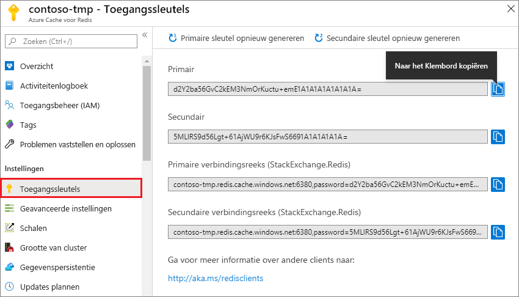

### Hostnaam, poorten en toegangs sleutels ophalen uit de Azure Portal

Als u verbinding wilt maken met een Azure-cache voor redis-exemplaar, moeten de cache-clients beschikken over de hostnaam, poorten en een sleutel voor de cache. Sommige clients kunnen enigszins andere namen gebruiken om naar deze items te verwijzen. U kunt de hostnaam, poorten en sleutels van de [Azure Portal](https://portal.azure.com)ophalen.

- Als u de toegangs sleutels wilt ophalen, selecteert u in de cache naar links de optie **toegangs sleutels**. 
  
  

- Als u de hostnaam en poorten wilt ophalen, selecteert u in de cache naar links de optie **Eigenschappen**. De hostnaam heeft de naam van het formulier * \<DNS>. redis.cache.Windows.net*.

  

