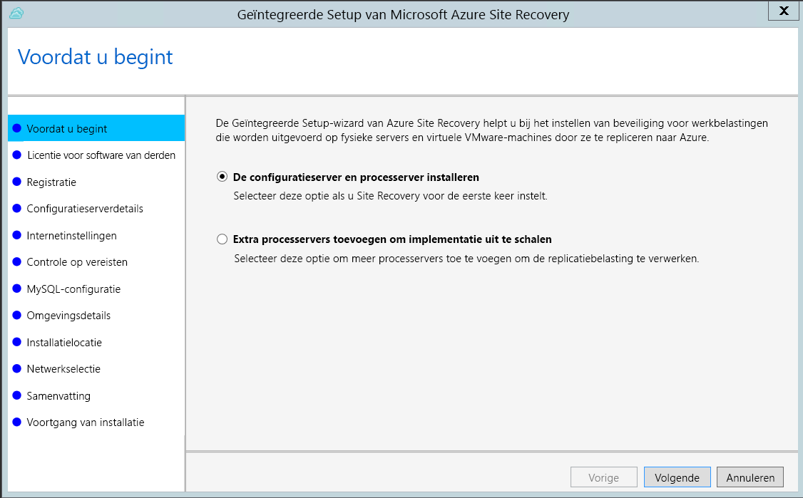
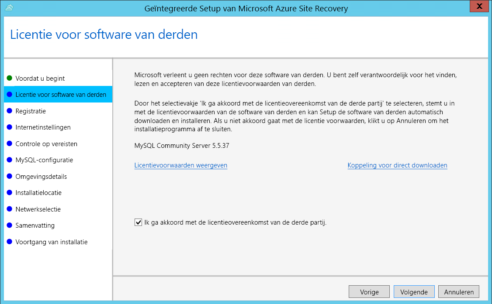
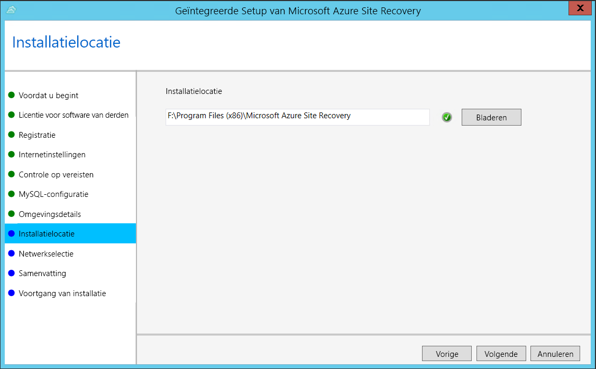

1. Voer het installatiebestand voor de geïntegreerde Setup uit.
2. In **voordat u begint**, selecteert u **de configuratie server en proces server installeren**.

    

3. Klik bij **Licentievoorwaarden voor software van derden** op **Ik ga akkoord** om MySQL te downloaden en te installeren.

    
4. Selecteer bij **Registratie** de registratiesleutel die u hebt gedownload uit de kluis.

    
5. Geef bij **Internetinstellingen** op hoe de provider die op de configuratieserver wordt uitgevoerd, via internet verbinding moet maken met Azure Site Recovery. Zorg ervoor dat u de vereiste Url's hebt toegestaan.

    - Als u verbinding wilt maken met de proxy die momenteel op de computer is ingesteld, selecteert u **verbinding maken met Azure site Recovery met behulp van een proxy server**.
    - Als u wilt dat de provider rechtstreeks verbinding maakt, selecteert u **rechtstreeks verbinding maken met Azure site Recovery zonder proxy server**.
    - Als voor de bestaande proxy verificatie is vereist of als u een aangepaste proxy voor de provider verbinding wilt gebruiken, selecteert u **verbinding maken met aangepaste proxy instellingen**en geeft u het adres, de poort en de referenties op.
     
6. Tijdens Setup wordt in **Controle op vereisten** gecontroleerd of de installatie kan worden uitgevoerd. Als er een waarschuwing wordt weergegeven over **Synchronisatiecontrole voor algemene tijd**, moet u controleren of de tijd op de systeemklok (instellingen voor **datum en tijd**) overeenkomt met de tijdzone.

    
7. Maak bij **MySQL-configuratie** referenties voor aanmelden bij de MySQL-serverinstantie die is geïnstalleerd.

    
8. Selecteer in **omgevings Details**Nee als u Azure stack vm's of fysieke servers wilt repliceren. 
9. Selecteer bij **Installatielocatie** waar u de binaire bestanden wilt installeren en de cache wilt opslaan. Het station dat u selecteert, moet ten minste 5 GB vrije schijfruimte bevatten, maar wij raden u aan een cachestation te gebruiken met minstens 600 GB vrije ruimte.

    
10. Selecteer in **netwerk selectie**eerst de NIC die de ingebouwde proces server gebruikt voor detectie en push-installatie van Mobility service op bron machines, en selecteer vervolgens de NIC die door de configuratie server wordt gebruikt voor de connectiviteit met Azure. Poort 9443 is de standaardpoort voor het verzenden en ontvangen van replicatieverkeer, maar u kunt dit poortnummer aanpassen aan de vereisten van de omgeving. Naast poort 9443 wordt ook poort 443 geopend. Deze wordt door een webserver gebruikt om replicatiebewerkingen in te delen. Gebruik poort 443 niet voor het verzenden of ontvangen van replicatie verkeer.

    

11. Lees de informatie bij **Samenvatting** en klik op **Installeren**. Wanneer de installatie is voltooid, wordt er een wachtwoordzin gegenereerd. U hebt deze nodig bij het inschakelen van de replicatie. Kopieer de wachtwoordzin daarom en bewaar deze op een veilige locatie.

    

Nadat de registratie is voltooid, wordt de server weer gegeven op de Blade **instellingen** > **servers** in de kluis.
