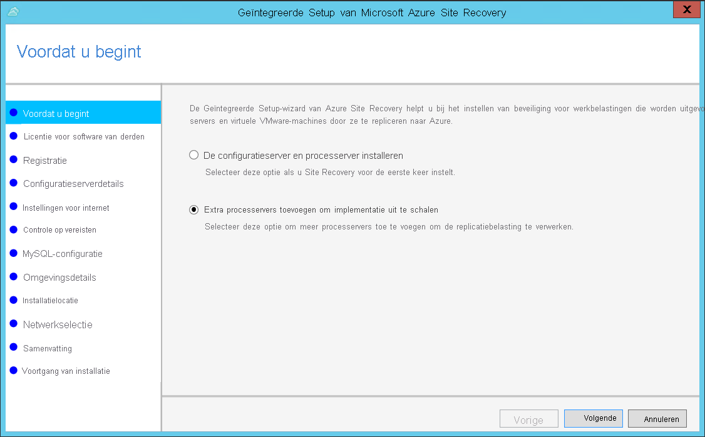
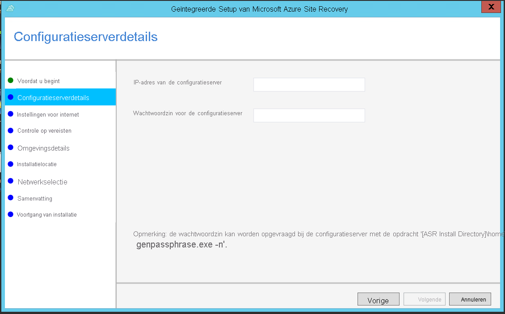
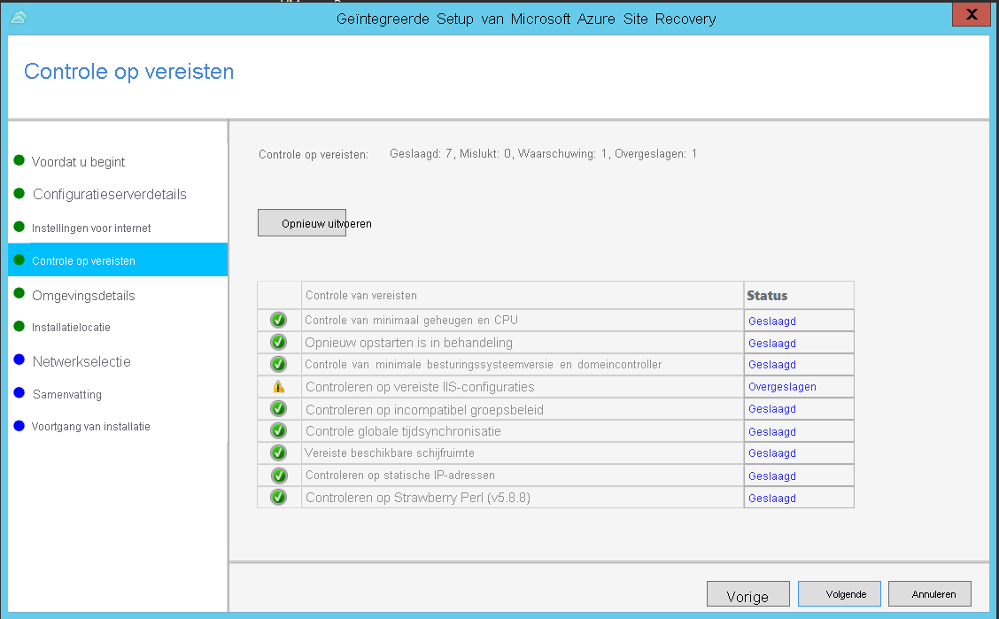
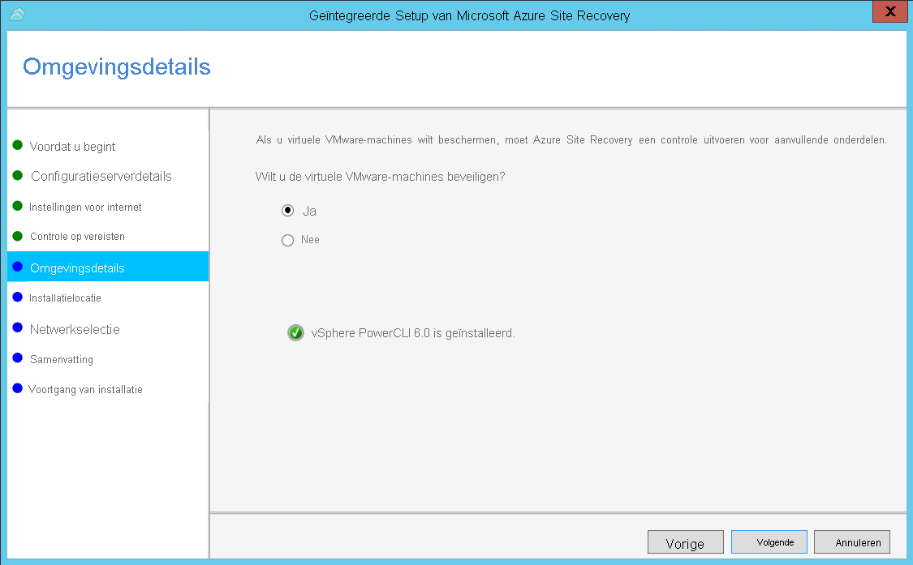
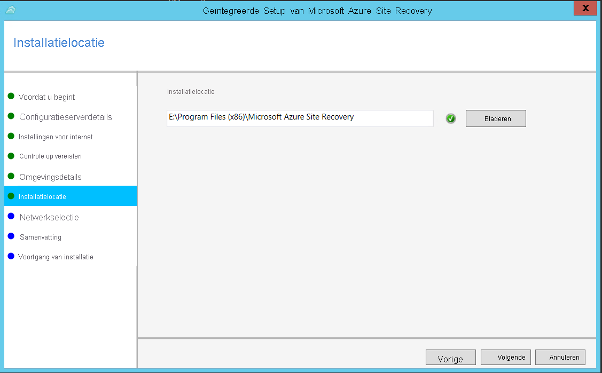
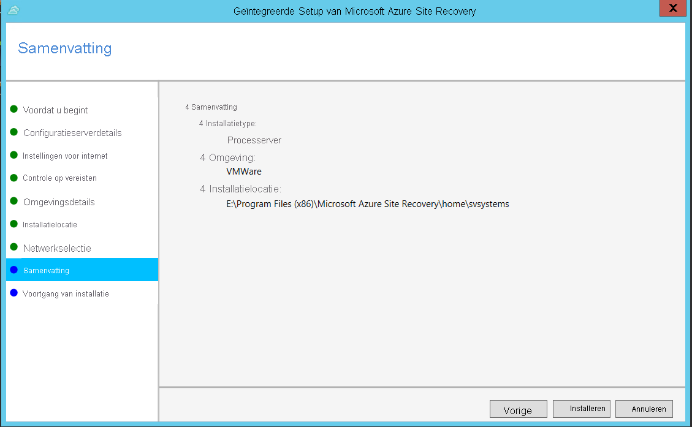

1. De Azure Site Recovery UnifiedSetup.exe starten
2. In **Voordat u begint** selecteert u **Add additional process servers to scale out deployment** (Extra processervers toevoegen om implementatie uit te schalen).

   

3. Bij **Configuration Server Details** (Serverconfiguratiedetails) geeft u het IP-adres van de configuratieserver en de wachtwoordzin op.

   
4. Geef bij **Internetinstellingen** op hoe de provider die op de configuratieserver wordt uitgevoerd, via internet verbinding moet maken met Azure Site Recovery.

   

   * Als u verbinding wilt maken met de proxy die momenteel op de computer is ingesteld, selecteert u **Verbinding maken met bestaande proxyinstellingen**.
   * Als u wilt dat de provider rechtstreeks verbinding maakt, selecteert u **Rechtstreeks verbinden zonder proxy**.
   * Als voor de bestaande proxy verificatie is vereist of als u voor de verbinding met de provider een aangepaste proxy wilt gebruiken, selecteert u **Verbinding maken met aangepaste proxyinstellingen**.

     * Als u een aangepaste proxy gebruikt, moet u het adres, de poort en de referenties opgeven.
     * Als u een proxy gebruikt, hebt u, als het goed is, al toegang tot de service-URL's toegestaan.

5. Tijdens Setup wordt in **Controle op vereisten** gecontroleerd of de installatie kan worden uitgevoerd. Als er een waarschuwing wordt weergegeven over **Synchronisatiecontrole voor algemene tijd**, moet u controleren of de tijd op de systeemklok (instellingen voor **datum en tijd**) overeenkomt met de tijdzone.

     

6. Selecteer bij **Details van de omgeving** of u virtuele VMware-machines wilt repliceren. Als dit zo is, wordt tijdens Setup gecontroleerd of PowerCLI 6.0 is geïnstalleerd.

     

7. Selecteer bij **Installatielocatie** waar u de binaire bestanden wilt installeren en de cache wilt opslaan. Het station dat u selecteert, moet ten minste 5 GB vrije schijfruimte bevatten, maar wij raden u aan een cachestation te gebruiken met minstens 600 GB vrije ruimte.
     

8. Geef bij **Netwerk selecteren** de listener op (netwerkadapter en SSL-poort) met behulp waarvan de configuratieserver replicatiegegevens verzendt en ontvangt. Poort 9443 is de standaardpoort voor het verzenden en ontvangen van replicatieverkeer, maar u kunt dit poortnummer aanpassen aan de vereisten van de omgeving. Naast poort 9443 wordt ook poort 443 geopend. Deze wordt door een webserver gebruikt om replicatiebewerkingen in te delen. Gebruik poort 443 niet voor het verzenden of ontvangen van replicatieverkeer.

     
9. Lees de informatie bij **Samenvatting** en klik op **Installeren**. Wanneer de installatie is voltooid, wordt er een wachtwoordzin gegenereerd. U hebt deze nodig bij het inschakelen van de replicatie. Kopieer de wachtwoordzin daarom en bewaar deze op een veilige locatie.

     
